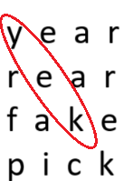

<div class='admonition caution'>
<div class='title'>Caution</div>
<div class='content'>
<ul>
<li>You are expected to work individually.</li>
<li><strong>Due: Friday, September 27th at 11pm EST (Baltimore time).</strong></li>
<li><em>This assignment is worth 60 points.</em></li>
</ul>
</div>
</div>


## Learning Objectives
<div class='admonition success'>
<div class='title'>Objectives</div>
<div class='content'>
<p>To practice with:</p>
<ul>
<li>2D arrays</li>
<li>strings</li>
<li>file I/O</li>
<li>command-line arguments</li>
<li>Makefiles</li>
<li>program organization</li>
<li>testing with <code>assert</code></li>
</ul>
</div>
</div>

<div class='admonition danger'>
<div class='title'>Individual Assignment</div>
<div class='content'>
<br/>
This is an individual assignment. This means you must NOT show your working code to another student, and should discuss with each other only the assignment requirements and expectations. See course staff for coding help. 
</div>
</div>

### Project Scaffolding ("Starter Code")

In the class public git repository, the folder `cs220-f24-public/homework/hw3/` contains several files you should use as a starting point for this assignment. From within the public repo, type `git status` to confirm your local copy is in good shape, then type `git pull` to copy this folder. Then copy these files to your personal cs220 repository to begin your work. If you compile the files as posted, you'll see a number of `unused parameter` errors reported, because the files contain incomplete function definitions. As you work on filling in the function definitions, you'll eventually eliminate these warnings. By the time you submit your code for grading, none of these warnings (or any others) should be reported.


### The Problem: Word Search

Write a program to solve a word search puzzle. Your program will accept a single command-line argument which is the name of a text file containing the word-grid. After reading the grid of letters from that file, you will read words for which to search from stdin. For each given word, you will print to stdout the location of all copies of that word in the grid. We have specific requirements detailed below regarding the structure of your solution code (see Implementation Requirements), test code that must be submitted (see Testing) and use of a makefile (see Makefile). Please read through the entire homework description (including Hints) before you begin. 


### Required Program Functionality

Unless otherwise noted, your program should exit with return value 0.
The program expects a filename as a command-line argument. If none is supplied, the program should output "Please enter a command line argument." and exit with return value `1`. If a filename is supplied but cannot be opened successfully, output "Grid file failed to open." and exit with return value `-1`.
A proper grid file contains an N x M grid of characters where both N and M are at most 10 and all characters in the grid are alphabet letters. Note that N and M can be different values but are always less than or equal to 10 (MAX_SIZE). There are N rows and M columns of letters (all lower case), followed by an empty line at the end of each row, with no spaces between the letters. Anything in the grid file after the empty line can be ignored.
There are only 3 types of invalid grids that your program must detect and report. In any of the following cases, your program should output "Invalid grid." and exit with return value `-2`:

* if there are any non-letter elements in the grid
* if two of the grid rows have differing numbers of letters
* if the number of rows or columns is 0 or greater than 10 (MAX_SIZE)

Search words read from stdin are separated by whitespace (any amount). The program should continue processing search words until it reaches the end-of-input (ctrl-d if stdin is not redirected). When the program is run first, it should print (to `stdout`) the number of rows and number of columns in the grid and then print the entire grid before waiting for the user to input the search word(s). See sample runs below. 

Words may appear in the grid 1-diagonally down, 2-diagonally up, 3-anti-diagonally down, and 4-anti-diagonally up with the characters in order in adjacent cells. These four search directions are defined as follows:

1-Diagonally Down (DD): this means the word is found on some diagonal pattern within the grid where the first letter of the searched word is at the top-left position of the diagonal and the last letter is at the down-right position.

In the following example, the word "bee" is found, on a diagonal down pattern, in two places:

<div style="margin: auto;">

</div>

2-Diagonally Up (DU): this is the opposite of DD, which means the word is found on some diagonal pattern within the grid where the first letter of the searched word is at the down-right position of the diagonal and the last letter is at the top-left position.

In the following example, the word "key" is found once on a diagonal up pattern:
<div style="margin: auto;">

</div>

3-Anti-Diagonally Down (AD): this means the word is found on some anti-diagonal pattern within the grid where the first letter of the searched word is at the top-right position of the anti-diagonal and the last letter is at the down-left position.

In the following example, the word "jay" is found once on an anti-diagonal down pattern:

<div style="margin: auto;">

</div>

4-Anti-Diagonally Up (AU): this is the opposite of AD, which means the word is found on some anti-diagonal pattern within the grid where the first letter of the searched word is at the down-left position of the anti-diagonal and the last letter is at the top-right position.

In the following example, the word "see" is found, on an anti-diagonal up pattern, in two places:

<div style="margin: auto;">

</div>

Different words might share characters. The program must search for each word in all 4 directions: DD, DU, AD, and AU (as described above.)

<div class='admonition info'>
<div class='title'>Note</div>
<div class='content'>
<br />
You may assume the content of the input grid file as well as all user inputs are in lower case!
</div>
</div>

For each appearance of a search word found in the grid, your program should output to stdout a line of text containing the matched word, the row number of the start of the word, the column number of the start of the word, and the direction of the match: DD for Diagonal Down, DU for Diagonal Up, AD for Anti-Diagonal Down, AU for Anti-Diagonal Up (as shown in the examples below). Rows and columns shown in the output are to be numbered starting with 0.

If multiple copies of a single search word are present in the grid, the program must locate and report each of them. The required order of the output lines for multiple appearances of a single search word `w` is as follows: 

* All appearances of `w` directed DD
* All appearances of `w` directed DU
* All appearances of `w` directed AD
* All appearances of `w` directed AU

Multiple appearances within each directional category (`DD`, `DU`, `AD`, `AU`) should be reported in order of occurrence of the first letter in the search word, when the grid is read row-by-row from left to right, starting with row 0. For example, if word w appears in the grid directed `DU` starting at row 4, column 3 and again directed `DU` starting at row 1, column 6, then the appearance starting at row 1, column 6 should be listed before the other `DU` appearance, and both `DU` appearances should be after any `DD` appearances are reported, but before any `AD` and `AU` directions are reported.

<div class='admonition tip'>
<div class='title'>Further Assumptions</div>
<div class='content'>
<ul>
<li>If no matches for a word are found, print the search word followed by " - Not Found" , as shown below.</li>
<li>You may assume the input word is never longer than `MAX_SIZE` characters.</li>
<li>You may assume there is no intervening whitespace among characters in `grid.txt`.</li>
<li>You may assume there are NO null terminators anywhere in `grid.txt`.</li>
</ul>
</div>
</div>

### Sample Runs
`grid.txt`, example input file with empty line at the end

```plain
pitka
olpeb
pkeyc
toped
```

Sample run #1, interactive user input shown (in bold) interleaved with program output

<div class="highlighter-rouge">
<pre>
<b>$ ./word_search grid.txt</b>
num_rows = 4 and num_cols = 5
pitka
olpeb
pkeyc
toped
<b>dyp</b>
dyp 3 4 DU
<b>ae</b>
ae 0 4 AD
<b>pit</b>
pit - Not Found
<b>ee</b>
ee 2 2 DD
ee 3 3 DU
ee 1 3 AD
ee 2 2 AU
<b>abcd</b>
abcd - Not Found
<i>[...user types Control-D...]</i>
</pre>
</div>

Sample run #2, interactive user input shown in bold:

<div class="highlighter-rouge">
<pre>
<b>$ ./word_search grid.txt</b>
num_rows = 4 and num_cols = 5
pitka
olpeb
pkeyc
toped
<b>lee pi e</b>
lee 1 1 DD
pi 1 2 DU
e 1 3 DD
e 2 2 DD
e 3 3 DD
e 1 3 DU
e 2 2 DU
e 3 3 DU
e 1 3 AD
e 2 2 AD
e 3 3 AD
e 1 3 AU
e 2 2 AU
e 3 3 AU
[...user types Control-D...]
</pre>
</div>

Sample run #3, redirected input using Unix echo and pipe

<div class="highlighter-rouge">
<pre>
<b>$ echo "po key nope" | ./word_search grid.txt</b>
num_rows = 4 and num_cols = 5
pitka
olpeb
pkeyc
toped
po 2 0 DD
key - Not Found
nope - Not Found
</pre>
</div>

### Implementation Requirements
* You may assume all program inputs as well as the content of the input grid file in is in lower case!
* The grid must be stored in a 2D array whose size will be set as 10x10 at compile time. 
* In the provided scaffolding file `search_functions.h`, a constant named `MAX_SIZE` is defined as 10. Your code must utilize `MAX_SIZE` rather than the literal value 10.
* Not every grid file will use the entire MAX_SIZE x MAX_SIZE array; your program should be able to handle this. The top left character in the grid (no matter the size of the grid) should be said to reside at row 0, column 0.
* You must not use any global (or extern) variables.
* Your main function must reside in a file named `word_search.c`, but you must factor out reusable code into (more easily) testable functions.
* Minimally, you must supply functions with exactly the following declarations, all of which are provided for you in scaffolding file `search_functions.h`:

```c
/*
 * Given a filename and a MAX_SIZExMAX_SIZE grid to fill, this function 
 * populates the grid and returns n, the actual grid dimension. 
 * If filename_to_read_from can't be opened, this function returns -1. 
 * If the file contains an invalid grid, this function returns -2.
 */
int populate_grid(int * m, char grid[][MAX_SIZE], char filename_to_read_from[]); 


/*
 * Each of these 4 functions returns the number of times the given 
 * word string was found in the grid facing the direction indicated
 * in the function name. Parameter n and m indicate num of rows and cols
 * respectively. The function sends corresponding output to the specified 
 * file pointer, which already points to an open stream. Output lines 
 * must appear in order of the first character's appearance in a 
 * left-to-right scan of each row beginning with row 0.
 */
int find_dd (char grid[][MAX_SIZE], int n, int m, char word[], FILE *write_to); 
int find_du (char grid[][MAX_SIZE], int n, int m, char word[], FILE *write_to); 
int find_ad (char grid[][MAX_SIZE], int n, int m, char word[], FILE *write_to); 
int find_au (char grid[][MAX_SIZE], int n, int m, char word[], FILE *write_to); 


/*
 * This function is similar to the other 4 find_ functions above, 
 * but reports ALL appearances of the given word, in the required 
 * DD, DU, AD, AU order.
 */
int find_all  (char grid[][MAX_SIZE], int n, int m, char word[], FILE *write_to); 
```

* You must separate out declarations of all non-main functions in your program into a header file named `search_functions.h.` Include there the required functions listed above, plus additional functions you elect to create. The accompanying file `search_functions.c` will implement the functions whose headers appear in `search_functions.h`. The file `word_search.c` will use those functions to implement the required program functionality described above. Both of these `.c` files must `#include search_functions.h`.
* In addition to the source files mentioned above, you are required to submit a testing main function, a working make file, and git log as described below.

### Testing

In addition to the source files listed above, you must write and submit a C file named `test_search_functions.c` that will contain a tester main function and `#include search_functions.h`. The file will also contain at least one helper test function per each of the functions declared in search_functions.h.  For example, if the declaration for a function named fun1 appears in `search_functions.h`, then `test_search_functions.c` should include a corresponding function named `test_fun1`. The job of each of the helper functions in `test_search_functions.c` is to test, using assert statements, that the corresponding function declared in `search_functions.h` works properly. The main function in `test_search_functions.c` will call each helper function in turn, and, if all of the tests pass, should output `All search_functions tests passed!` to indicate success.

### Makefile
You must submit a working `Makefile` with at least a `word_search` target that builds your program to create an executable named `word_search` and a test target that builds and runs your testing executable. To be considered fully functional, your Makefile should correctly build the executables with the appropriate flags when (and only when) one of the relevant source files has changed. The Makefile should be named `Makefile` (spelling and case are important).

### Git Log
You are expected to use git to backup your progress on this project. Include in your submission a copy of the output of git log showing at least five commits to the repository of code from this assignment, with meaningful commit messages. (You should commit early and often, likely every time you have a version that compiles, so you should probably have many more than five of these). Just before submitting your work, save the output into a file called `gitlog.txt` by executing:

```bash
git log > gitlog.txt
```

### Submission Checklist
Your Gradescope submission should contain at least the following files:

```plain
* word_search.c
* search_functions.h
* search_functions.c
* test_search_functions.c
* test1.txt, test2.txt, and any additional data files created by you which your tester functions require
* Makefile
* gitlog.txt
```


### Hints and Tips

Here are some further hints and tips:

<div class='admonition tip'>
<div class='content'>
<ul>
<li>Make the DD search as clean and efficient as possible before attempting to write searches in other directions.</li>
<li>Instead of writing a new search function to search in reverse for a word, reverse the word itself and apply your original searches (DD, AD) to it.</li>
<li>Make use of gdb to help debug your program.</li>
<li>Write your function tester functions early, rather than waiting until the last minute. Their purpose is to help you catch bugs in the functions early on, so the bugs don't cause problems when used by main. Using this approach as intended will help you track down bugs more easily.</li>
<li>If in testing your program's output, you want to determine whether two files are identical (e.g. when one file contains your program's actual output and the other contains the expected output), the completed function named file_eq provided for you in the test_search_functions.c file will be useful!</li>
<li>In addition to writing tests for individual helper functions that are included in your submission, you'll need to create and utilize "end-to-end" tests for your complete word search as well. By "end-to-end" testing, we simply mean running the entire program and checking if it behaves as desired on a number of different inputs. Your end-to-end tests do not need to be handed in.</li>
</ul>
</div>
</div>


### Submission
Create a *.zip* file named *hw3.zip* which contains all the requested files mentioned above. (Do not zip your entire hw3 folder - only the files.) Copy the *hw3.zip* file to your local machine and submit it as Homework 3 on Gradescope. 

<div class='admonition caution'>
<div class='title'>Caution</div>
<div class='content'>
<br/>When you submit, Gradescope conducts a series of automatic tests.  These tests do basic checks like making sure that you submitted the right files and that your `.c` file compiles properly.  If you see error messages here (look for red), address them and resubmit. 
</div>
</div>

<div class='admonition tip'>
<div class='title'>No-compile policy</div>
<div class='content'>
<br/>Remember that if your final submitted code does not compile, you will earn a zero score for the assignment.
</div>
</div>


<div class='admonition tip'>
<div class='title'>Tips and Hints</div>
<div class='content'>
<ul>
<li>You may re-submit any number of times prior to the deadline; only your latest submission will be graded.</li>
<li>Review the course syllabus for late submission policies (grace period and late days). You will want to save your late days for the future assignments as they will be more involved.</li>
</ul>
</div>
</div>


<div class='admonition tip'>
<div class='title'>Code Styling - Style Matters!</div>
<div class='content'>
<br/>
You should also make sure that your code has good style. You can look at the [coding style guidelines here](https:https://jhucsf.github.io/fall2024/resources/style.html) from a course you will take later that also applies to this course. In brief, you should make sure that your submission is well formed:
<ul>
<li>it is not overcommented or undercommented</li>
<li>there are no ambiguous variable names </li>
<li>there is proper/consistent bracket placements and indentation</li>
<li>there are no global variables</li>
<li>line and functions are a reasonable length</li>
</ul>
</div>
</div>

Two notes regarding automatic checks for programming assignments:
*	Passing an automatic check is not itself worth points. (There might be a nominal, low point value like 0.01 associated with a check, but that will not count in the end.) The checks exist to help you and the graders find obvious errors. This will be true for most of the assignments; the actual grades are given manually by the graders, along with comments.
*	The automatic checks cover some of the requirements set out in the assignment, but not all. There will be hidden tests that test edge cases. In general, it is up to you to test your own work and ensure your programs satisfy all stated requirements. Passing all the automatic checks does not necessarily mean you will earn all the points. Also remember that the course staff can *not* reveal the tests or their outcomes to you. 

