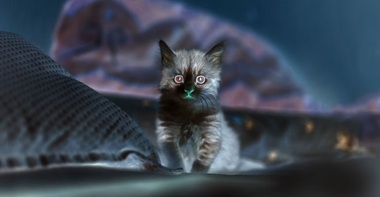
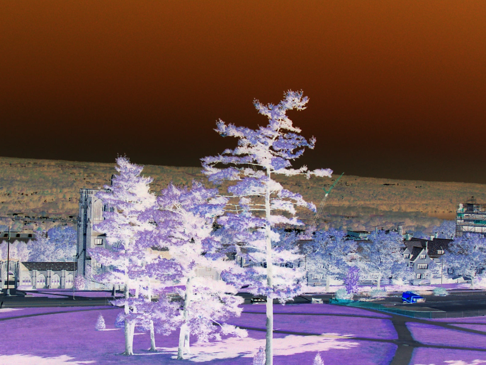
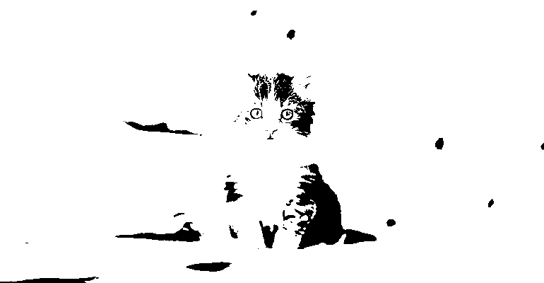
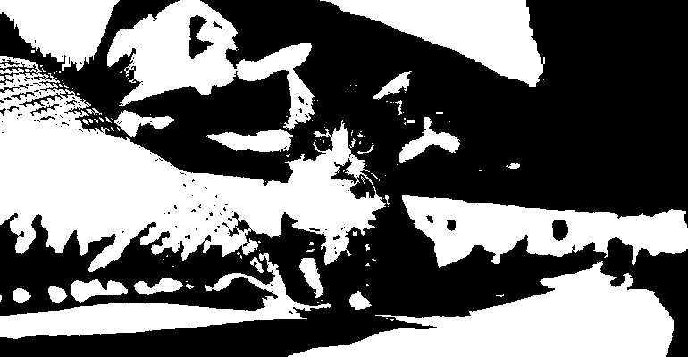
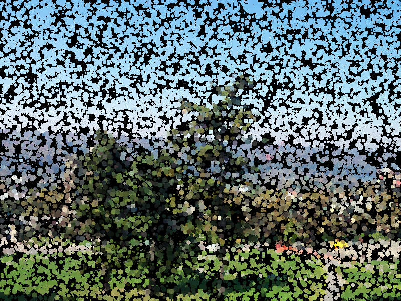

<div class='admonition caution'>
<div class='title'>Important Dates</div>
<div class='content'>
<ul>
<li>You are expected to work in a team of two.</li>
<li>Released: Friday Oct 4th</li>
<li><strong>Development Plan Due: Friday Oct 11th at 11pm</strong></li>
<li><strong>Project Zip Due: Wednesday Oct 23rd at 11pm</strong></li>
<li><strong>Partner Evaluation Form Due: Wednesday Oct 30th at 11pm</strong></li>
<li>This project is worth 150 points total</li>
<li>No late days may be used!</li>
</ul>
</div>
</div>

## Learning Objectives
<div class='admonition success'>
<div class='title'>Objectives</div>
<div class='content'>
<p>To practice with:</p>
<ul>
<li>structs</li>
<li>binary file I/O</li>
<li>data representations</li>
<li>dynamic memory allocation</li>
<li>random numbers</li>
<li>makefile</li>
<li>development tools `gdb`, `valgrind`, `git`</li>
</ul>
</div>
</div>

## General Requirements

This is a team of two programming assignment, meaning you and a partner will collaboratively write and submit the source code for a program. You and your partner should take a "paired programming" approach, where you frequently work together at a single screen. In this approach, at any given time one person is the "driver" with their hands on the keyboard, and the other is the "navigator" watching and guiding the driver. You should switch roles regularly. This method is particularly effective when you are testing and debugging your program. Remember, you are both responsible for all the code you submit and will receive the same grade.

As usual for coding assignments, you are required to use the `git` version control system and include a *log file* with your project submission. Both partners must make sigificant commits to the project. A new team repo will be created for you in our cs220 organization on github which both teammates must use for this project. 

<div class='admonition caution'>
<div class='title'>Project Repo</div>
<div class='content'>
We will provision you a separate repo for your midterm project under the `jhu-ip` organization and both team members along with course staff will be invited to have an admin role on the repo. You will both need to clone this new repo to get started. You should anticipate some conflicts when sharing a repo, and will need to resolve and merge them appropriately. Frequent commit/push/pull sequences are even more important in this situation.
</div>
</div>

This project is larger and more complex than previous programming assignments. Additionally, since you have now been exposed to most of what C can do, there are no restrictions on what language features you can use (other than the conventions of good style, of course; you still shouldn't use global variables, for example).


<div class='admonition danger'>
<div class='title'>Valgrind Note</div>
<div class='content'>
From this point forward in the semester, your programs will need to not only compile and run cleanly (i.e. with no warnings, errors, or crashes), but also must not have any memory-related issues as reported by valgrind.
</div>
</div>

<div class='admonition tip'>
<div class='title'>Viewing Images</div>
<div class='content'>
<p>For this project, you will be working with images in a PPM formt (described below). You will need to view images directly on the ugrad servers, which requires a few extra steps:

1. Set up X-tunnelling by installing <a href="https://sourceforge.net/projects/xming/">XMING</a> on Windows or <a href="https://www.xquartz.org/">XQuartz</a> on Mac (Reach out to us if you need help to set this up).
2. Once you have the appropriate program running, enable X-tunnelling when you connect to the ugrad server: use -Y on a Mac when you `ssh` into ugrad or with Putty, simply enable the X-11 forwarding option before connecting.
3. `feh` is a very simple command-line image viewer.  It is available on ugrad machines and you can simply run the program with the name of an image file as a command-line argument, and it will [slowly] display the image on your screen. e.g.
</p>
<p>
<code>$ feh myimage.ppm</code>
</p>

Please note that if you are using emacs while X-tunnelling is enabled, you will have to run it with the command `emacs -nw` to still run it in the terminal ("nw" stands for "no window".) Other in-terminal editors may have similar options.

<strong>Note:</strong> Before connecting to ugrad and running `feh`, make sure either Xming or Xquartz is running and x-tunneling is enabled as described above.
</div>
</div>

If you are using a different platform, you are welcome to use an image viewer of your choice; `feh` is easy to install using most linux package managers, but there are other open source image viewing programs, as well as alternatives for Windows and MacOSx.

## Program Description

This program will be an image processing program, in the vein of Photoshop. It will have a command-line-based user interface (UI), so there will be no graphical interface, and the range of operations will be limited, but the algorithms you will use are similar to the ones used in programs like Photoshop or GIMP.

At a basic level, your program will be able to read image files from disk (ie, the file system), perform one of a variety of image processing tasks, and then write the result back to disk as a new image file. Since your program will not have a GUI, you will use external programs to view the images. If you are on ugrad (either locally, or remotely with X-tunnelling), you can use the program `feh`.

While there are many formats for storing image files, your program will **only** need to read and write one, the **PPM** format. This is essentially the simplest and easiest format to read and write, which is why it was chosen; its main drawback is that it does not use any kind of compression, so images stored in this format tend to be on the large side when compared to formats like JPEG or PNG or GIF. An implementation to read PPM files is provided for you. However, you will need to write the corresponding function to write to a PPM file format. (See `ppm_io.h` and `ppm_io.c` in the starter code.)

<div class='admonition caution'>
<div class='title'>Starter Files</div>
<div class='content'>
<p>Make sure to do a `git pull` on the public repo before starting to work to get the starter files for this project. You must work with the starter files!</p>
</div>
</div>

### PPM image format

For this assignment, we will use a very simple image-file format called PPM. It's an uncompressed format, meaning that the images will take up a lot of disk space (compared to JPG or PNG files), but it's very easy to read and write from C code (which is why we're using it). For the formal "official" description of the PPM format, see the [netpbm site](http://netpbm.sourceforge.net/). Because these PPM files can be very large, be careful not to fill up your ugrad storage quota with too many cat pictures...

<div class='admonition success'>
<div class='title'>'convert' Command</div>
<div class='content'>
<p>
NOTE: you can use a unix program called `convert` to convert between image formats; e.g. to convert an existing file called "selfie.jpg" into a PPM, you would type:
</p>
<p>
<code>$ convert selfie.jpg selfie.ppm</code>
</p>
<p>
This works for most image format file extensions; it converts to/from most known image formats, including .jpg, .gif, .png, .ppm, .tiff, and .pdf, and is installed on the ugrad machines. If it's not installed on your local machine (or virtual machine), most linux package managers can install it (or can install ImageMagick, which is the suite of tools that `convert` is part of).
</p>
</div>
</div>

The PPM format itself is pretty simple (compared to most other image formats). Basically, at the top of the file will be a special "tag" that marks the file as a PPM; this should be P6. Then, there are three numbers, separated by whitespace; these numbers represent the size of the image as columns, rows, and colors. Columns and rows specify the width and height of the image (in pixels) respectively. (BEWARE: columns come before rows in this format!) The colors value encodes how many different shades of each color a pixel can take on; for this assignment, this number must always be 255 (you must reject any image that uses a different value, but you're unlikely to encounter one). Immediately after the 255, the binary data encoding all the image pixels will begin.

Optionally, there may be lines starting with a #, which are comments and should be ignored; these may be intermixed with the above information. You don't need to store these; if you read a file and then re-write it, it's fine if the comments get lost. The files we test your code with, however, will have either 0 or 1 comment lines just after the P6 tag, but no comment lines between the other header values (see `trees.ppm` in the course public repo for an example).

All of this will be ANSI text, so you can use the normal text I/O functions (e.g. fgetc(), fscanf(), fprintf() etc.) to read/write the header information.

After the color size specification, there will be a single whitespace character (usually a newline, but that's not guaranteed), after which the remainder of the file will be the actual pixel values. Basically, each "pixel" consists of three values; the first value is the "red" channel, the second value is the "green" channel, and the third value is the "blue" value. Taken together, these three values specify a single color, which is the RGB color value of that pixel. Since the max color value is 255, each of these values will be in the range 0-255, which fits exactly in one byte of memory. For more information about RGB color codes see [Wikipedia](https://en.wikipedia.org/wiki/RGB_color_model).

The easiest way to read the pixel values is to create a struct that contains three unsigned char variables, one per color channel. Then, create an array of your pixel structs with rows * cols elements. At that point, you can just use fread() to read the entire array of pixels from the file in one go. Similarly, you can use fwrite() to write the whole pixel array with a single function call. We've started this off for you in the provided `ppm_io.h` and `ppm_io.c` files.

Your first coding task for this project is to write a few of the functions in the `ppm_io.c` implememtation file:

* `write_ppm` - function to write from an Image variable to an external file in the PPM format
* `make_image` - function to allocate memory for an Image of a specified size
* `free_image` - function to free the dynamically allocated memory for an Image

We have provided the implememtation of `read_ppm` (function to read a PPM formatted file into an Image), along with the `struct` definitions this project must use. 


## Operational Overview

Your program will be a command line tool, always run with the name of the executable file project followed by (minimally) the name of an input PPM file, the name of a desired output PPM file, and the specific lower-case name of an image processing operation, as listed below. Some operations require additional arguments, which will also be supplied at the command line by the user, at the end of the line. There are no prompts and no input entered by the user interactively.

<div class='admonition info'>
<div class='title'>First Two Commandline Args</div>
<div class='content'>
Regardless of the desired operation, the first two arguments after the executable name project are always interpreted as the input file name followed by the output file name. The next argument is always interpreted as the operation name, and the operation's arguments (if any) come after that.
</div>
</div>

The operations your program will be able to recognize and perform are all of the following, listed roughly in easiest to hardest implementation. The bolded words are the operation names to be entered at the command line by the user. More detail for each operation is provided below.

1. [**invert**](#invert) - invert the colors (i.e. black becomes white, white becomes black, etc.)
2. [**crop**](#crop) - crop the input image given corner pixel locations
3. [**zoom_out**](#zoom_out) - zoom out on an image
4. [**binarize**](#binarize) - convert the input image to black and white by thresholding
5. [**pointilism**](#pointilism) - apply a pointilist filter to the input
6. [**blur**](#blur) - blur the image using a Gaussian filter with a prescribed standard deviation `sigma`

For example, at the command prompt, a user of your program might type:

```sh
$ ./project building.ppm building_crop.ppm crop 50 50 500 500
```

to crop the input image `building.ppm` (in PPM format) and output the cropped image to `building_crop.ppm`, where `(50, 50)` and `(500, 500)` specify the top-left and bottom-right pixel locations of the cropped region.

For another example, at the command prompt, a user of your program might type:

```sh
$ ./project trees.ppm trees_blur.ppm blur 3
```

to blur the input image `trees.ppm` (in PPM format) and output the blurred image to `trees_blur.ppm`, where `3` specifies the standard deviation of the Gaussian filter.

Once you implement the missing ppm_io.c functions, you can then checkout the provided demo program `checkerboard`. Compile the demo program by running `make checkerboard`; an executable `checkerboard` should be generated. The program demonstrates how to use `ppm_io` to read and write PPM formated files, and also shows how the `struct Pixel` and `struct Image` are used.

<div class='admonition success'>
<div class='title'>Compare</div>
<div class='content'>
<p>
In the starter code, we also provide a helper executable `img_cmp`, which you could run on ugrad machine to compare if two PPM files are the same up to a tolerance. It's usage is:
</p>

<code>$ ./img_cmp PPM_file1 PPM_file2 [tolerance = 0]</code>

<p>
The program takes two PPM files with the same dimension and compares them pixel by pixel.
It counts how many pairs of pixels are within the given tolerance.
A pair of pixels (with same row and col indices) of two images is said within the tolerance if each absolute difference of their three channel values is less than or equal to the tolerance.
For example, if you run:
</p>

<p>
<code>$ ./img_cmp checkerboard1.ppm checkerboard2.ppm 5</code>
</p>

it should tell you how many pair of pixels in `checkerboard1.ppm` and `checkerboard2.ppm` have an absolute difference of more than 5 (i.e. intensity difference).
</div>
</div>

After you have reviewed `checkerboard.c` and `ppm_io.h`, and completed the `ppm_io.c` file, as an initial test to be sure you're on the right track, try to read in a PPM file and write it out unchanged.  Use the `img_cmp` program to verify the two files are exactly the same (tolerance 0). Once this works well, begin successively working through the operational commands as listed.


### Scaffolding Folder
The scaffolding (i.e. starter code) folder for this project (available in the public repository) provides you with `ppm_io.c`, `ppm_io.h`, `checkerboard.c`, `project.c`, `img_cmp.c`, and a `Makefile` for the project. It also contains some testing PPM files in a folder named `data` and some expected results in a subfolder named `results`, which is in the PPM format. Lastly, we provide starter files `image_manip.h` and `image_manip.c` which is where your implementations of the various transformation operations should be added.

<div class='admonition info'>
<div class='title'>Note</div>
<div class='content'>
<p>Note that the results displaying on this page are png versions. You should use the provided PPM ones for comparison.</p>
</div>
</div>

We encourage you to store the provided PPM images and all created images in a subfolder of your own repository named data, to keep your images separate from your source code files. You don't need to submit any PPM files to us; keeping them in a separate folder will help you avoid accidentally including them.

<div class='admonition tip'>
<div class='title'>Tip</div>
<div class='content'>
<p>If you're using the `data` subfolder, we suggest you to execute your code from within the `data` folder by typing <code>../project</code>, so you can refer to input filenames while the program is executing directly as `kitten.ppm`, rather than `data/kitten.ppm`, saving yourself the extra typing while testing.</p>
</div>
</div>

## Implementation Details

This section contains detailed descriptions of the image processing operations that you will implement for this assignment. We use the following sample images for all the all examples/operations illustrated below.

||
|:--:|
|The original kitten image|


||
|:--:|
|The original trees image|

### Invert

Inverting color values is very straightforward; simply take the value of each component of each pixel, and calculate its "inverse" by subtracting its value from 255. If you apply the invert transform to the `kitten.ppm` and `trees.ppm` images, the results should be as shown below. If you invert that resulting photo, you should get the original photo back.

||
|:--:|
|The inverted kitten image|

||
|:--:|
|The inverted trees image|

### Crop
Cropping an image is pretty common. For this operation the user must specify the two corners of the section they want to crop (ie, keep) - one inclusive and one exclusive. That will mean 4 integer values: the column and then row of the upper-left corner (both inclusive values), and the column and then row of the lower-right corner (both exclusive values). By looking at the differences between those values, you can calculate the size of the new image; this will let you allocate the correct amount of space for the pixel array. Once you've done that, you can just use a loop to go through the pixels of the specified region in the original image, and copy each component of each pixel to the new image. You should check whether exactly 4 additional arguments are provided for the cropping operation, and check if the specified corners are senseless or not. You should report appropriate errors.

If you crop the `kitten.ppm` image from (top col=200, top row=200) to (bottom col=300, bottom row=300), the result should have 100 rows and 100 columns and look like:

||
|:--:|
|The kitten image cropped with 200 200 300 300|

### Binarize

To binarize an image into a black and white format, we use thresholding. Therefore, this operation will take an additional input parameter as a $$threshold$$, which is expected to be an integer and in the range between $$0$$ and $$255$$ inclusively. In your program, you should check if there is exactly one parameter provided for the binarize operation.  Otherwise, you should report an error. You also need to check if the input $$threshold$$ is an integer or not, and check if it is a valid number between $$0$$ and $$255$$.  If not, you should report an error.

To implement this operation, you will need to first convert each pixel to a grayscale version using the provided `pixel_to_gray` helper function. Then, you can calculate a single $$binary$$ value by comparing the $$grayscale$$ value with the $$threshold$$ value. The $$binary$$ value is set to $$0$$ if the $$grayscale$$ value is smaller than the threshold.  Otherwise, it is set to $$255$$.  For each pixel, assign the same $$binary$$ value to all three color channels of your output image.

For example, if you run the below command:

```sh
$ ./project kitten.ppm kitten-binarize-127.ppm binarize 127
```
the result should look like:

||
|:--:|
|The binarized kitten image with threshold 127|

If you run:

```sh
$ ./project kitten.ppm kitten-binarize-200.ppm binarize 200
```
the result should look like:

||
|:--:|
|The binarized kitten image with threshold 200|

### Zoom_out
To keep things straightforward, you will only implement a single zoom out scale. In order to perform a zoom out, we take a 2X2 square of pixels in the input image and average each of the three color channels of the four pixels to make a single pixel. This means a zoomed out picture has half as many rows and half as many columns as the original image. However, note that the number of rows and/or columns in the input image might be odd. In this case we will simply discard the data in the odd bottom row and/or odd rightmost column.

```
./project kitten.ppm kitten_zoom_out.ppm zoom_out
```
will result in:

||
|:--:|
|The zoomed out kitten image|

and,

```
./project trees.ppm trees_zoom_out.ppm zoom_out
```
will result in:

||
|:--:|
|The zoomed out trees image|

<div class='admonition tip'>
<div class='title'>Tip</div>
<div class='content'>
Make sure that your output image has correct dimensions; that is both the number of rows and number of columns in the zoomed out image is half the number of rows and number of columns in the original image. Also note that "zoom_out" is the corresponding input command line argument that we type in when executing this operation.
</div>
</div>
 
### Pointilism

Pointilism is a painting technique that uses distinct colored dots. You can read about it [here](https://en.wikipedia.org/wiki/Pointillism). In this part, we would like to apply a pointilism-like effect to an input image. In order to accomplish this, we randomly select a small set (3%) of the pixels in the input image and apply the effect to them. To do so, imagine that each randomly selected pixel is at the center of a circle with a random radius of between 1 and 5. Now, applying the pointilism effect comes down to coloring all the pixels that reside in that circle with the same color as the color of the randomly selected pixel which is at the center of the circle. This gives the input image a cool "painting-like" look by creating a set of small filled circles (i.e., dots) across the image, where each dot is uniformly colored with the color of the randomly selected pixel which is located at the center of that dot. Note that if a randomly selected pixel is near or at a boundary, then you do not need to apply the effect to the parts that may extend past the borders of the image.

For example, if we do:

```
./project trees.ppm trees_pointilism.ppm pointilism
```

the following will result:

||
|:--:|
|Pointilism applied on trees image|


<div class='admonition note'>
<div class='title'>Note 1</div>
<div class='content'>
Make sure to apply the effect on only 3% of the total pixels of the input image. For instance, if the input image dimensions are 800x600, then you should apply the effect to only 14400 randomly selected pixels. Also, for each randomly selected pixel, use a random radius between 1 and 5 (i.e, 1 ≤ radius ≤ 5) when creating the filled colored dot.
</div>
</div>

<div class='admonition note'>
<div class='title'>Note 2</div>
<div class='content'>
When implementing this operation, you will need to generate random numbers. To facilitate the testing and grading of your work, do not make any calls to srand() function in your code. In other words, do not change the default seed value of 1 (recall that not calling srand is the same as calling srand(1)) to keep things predictable and testable.
</div>
</div>


### Blur

The blur operation is more complex than some of the previous operations, because you need to consider more than one pixel at a time. At the simplest level, a blur works by taking each pixel, and setting its value to some kind of average of all the pixels in a small neighborhood around it. The simplest blur possible would just set each pixel to the average of itself and the pixels adjacent to itself (computed for each color channel separately). However, this kind of blur isn't as pretty as we might like. What we will do for this assignment is similar, but more clever.

For the kind of blurring effect that a program like Photoshop would give you, you will need to weight the importance of neighboring pixels according to a Gaussian distribution. This is referred to as a "Gaussian blur" ([Wikipedia](https://en.wikipedia.org/wiki/Gaussian_blur)), and this is what you will implement for this assignment.

First, you need to create an `NxN` matrix that holds the values of a 2D (symmetric) Gaussian distribution with a given variance (we assume 0-mean). `N` should be big enough to be at least _10*sigma_ positions wide (to span approximately _5*sigma_ positions in each direction), and `N` should always be an odd number (so there's an equal number of rows/columns on either side of the center. If `dx` and `dy` store the two coordinates as offsets from the center (i.e. delta-from-mean), then the Gaussian value can be calculated as (written as code):

```c
double g = (1.0 / (2.0 * PI * sq(sigma))) * exp( -(sq(dx) + sq(dy)) / (2 * sq(sigma)));
```

Note that you will need to include math.h and link with -lm to get the exp() function. We have provided sq() to square its argument as a #defined macro and PI as a #defined constant in `image_manip.h`.

As an example, if sigma is `0.5`, then we would get a 5x5 Gaussian distribution matrix like this:

```
0.000000  0.000029  0.000214  0.000029  0.000000
0.000029  0.011660  0.086157  0.011660  0.000029
0.000214  0.086157  0.636620  0.086157  0.000214
0.000029  0.011660  0.086157  0.011660  0.000029
0.000000  0.000029  0.000214  0.000029  0.000000
```

If sigma was `1.0`, we would get an 11x11 matrix:

```
0.000000  0.000000  0.000000  0.000000  0.000000  0.000001  0.000000  0.000000  0.000000  0.000000  0.000000
0.000000  0.000000  0.000001  0.000007  0.000032  0.000053  0.000032  0.000007  0.000001  0.000000  0.000000
0.000000  0.000001  0.000020  0.000239  0.001072  0.001768  0.001072  0.000239  0.000020  0.000001  0.000000
0.000000  0.000007  0.000239  0.002915  0.013064  0.021539  0.013064  0.002915  0.000239  0.000007  0.000000
0.000000  0.000032  0.001072  0.013064  0.058550  0.096532  0.058550  0.013064  0.001072  0.000032  0.000000
0.000001  0.000053  0.001768  0.021539  0.096532  0.159155  0.096532  0.021539  0.001768  0.000053  0.000001
0.000000  0.000032  0.001072  0.013064  0.058550  0.096532  0.058550  0.013064  0.001072  0.000032  0.000000
0.000000  0.000007  0.000239  0.002915  0.013064  0.021539  0.013064  0.002915  0.000239  0.000007  0.000000
0.000000  0.000001  0.000020  0.000239  0.001072  0.001768  0.001072  0.000239  0.000020  0.000001  0.000000
0.000000  0.000000  0.000001  0.000007  0.000032  0.000053  0.000032  0.000007  0.000001  0.000000  0.000000
0.000000  0.000000  0.000000  0.000000  0.000000  0.000001  0.000000  0.000000  0.000000  0.000000  0.000000
```

Basically, the sigma parameter lets you control how strong the blur effect is; the larger your sigma, the more blurry your image will become.

Once you have this Gaussian "filter" matrix, you'll need to "convolve" it with your image. That's fancy math terminology that basically means you loop over the pixels of your input image, and for each pixel, you place your filter on your image centered at that pixel, and then for each element of the filter, multiply it by the pixel value underneath that element. Then, you set the value for the pixel of the output image to be the normalized sum of those values. Basically, this is a fancy way of describing a weighted average; the values in the matrix are the weights that get applied to the corresponding pixels of the input image. To normalize, you just sum up the values in the filter matrix, and divide the sum of the weighted pixel values by it; that ensures that you're not brightening or darkening the image when you blur it.

You will also need to be careful near the edges of the image, since the parts of filter may extend past the border of the image. In your calculations, just skip the filter positions that hang off the edge. (This is why the normalization is important even if the values in your matrix sum to 1).

You will blur all three color channels in this fashion.

You will likely want to implement this in several functions. For instance, you may want a function that generates a Gaussian matrix of a given size and variance, a function to find the filter response for one pixel of the input image, and finally a function that calls the first function, then loops over the pixels of the input image and calls the second function for each pixel in order to generate the output image.

If you apply the blur transform with different sigma values to the ```kitten.ppm``` image, the result should look like the images shown below. (Note that blur may be a bit slow, and the larger a radius you use, the slower it will be.)

```
./project kitten.ppm ../results/kitten_blur_5.ppm blur 5
```

||
|:--:|
|The blurred kitten image sigma 0.5|

||
|:--:|
|The blurred kitten image sigma 1|

||
|:--:|
|The blurred kitten image sigma 5|

## Error Reporting
The approach your program will take for error reporting is to have your `main()` method return a `0` value indicating success or a positive value indicating failure. Which positive value your program should return is indicated in the table below. If more than one error condition occurs, your program should return the error code listed earliest in the table below.

In addition to returning the specified value, your program should also output an informative error message to `stderr`. (The text of the error messages will not be specified; we'll leave the exact wording up to you.)

| Return value | Error condition it signifies |
|--------------|------------------------------|
| 0 | No errors detected |
| 1 | Wrong usage (i.e. mandatory arguments are not provided) |
| 2 | Input file I/O error |
| 3 | The Input file cannot be read as a PPM file |
| 4 | Unsupported image processing operations |
| 5 | Incorrect number of arguments for the specified operation |
| 6 | Invalid arguments for the specified operation |
| 7 | Output file I/O error |
| 8 | Other errors not specified above |

## Development Plan
This project is (much!) bigger than any of the homeworks you've completed so far, and having a teammate to help means that you can both benefit from your teammate's expertise, but also need to plan more carefully.  Thus, as part of this project, you are expected to create a **development plan** to keep track of tasks that need to be completed.  We suggest the following process:

* Start by brainstorming the tasks that are required to complete the project successfully.  The sections above detail the image operations that your project is required to support, and below is a suggestion of how you could break these down into individual files.  These operations and files are a good task list a good starting point -- but, they may need to be broken down into smaller tasks.  Make sure you consider testing as well!  You do **not** want to turn in a project that has not been tested!

* Consider the relative difficulty of tasks.  Some of the image operations are expected to be considerably easier than others.  How much easier?  That's up for you and your partner to discuss.  Header files are likely to be relatively small tasks, particularly in comparison to the actual implementation.  We are not expecting you to come up with exact estimates here (for instance, 35 minutes to implement `ppm_io.h`, or 130 minutes to implement the `invert` operation).  Instead, try to identify (approximate) relative difficulties.  Do you think that `zoom_out` is twice as difficult as `invert`?  Four times as difficult?  Ultimately, the answer that you come up with is not so important as the _process_ of discussing with your teammate _why_ you think what you do (so long as the answer is not totally insane -- if you consider one task to be 20 times as difficult as another, you should have a very good reason!)

* Estimate _task dependencies_.  What tasks depend on each other?  For each task that you complete, what new tasks can now be completed?  For example, the `read_ppm` function is probably necesary to complete pretty much all of the other functions, since you'll want to read an image before you can modify it.  Hence, we provide this function to you.  It's also probably pretty important to be able to write an image back out, so that you can run `img_cmp` to compare the image your program produced with the image expected.  Do you think that any of the other functions you're supposed to implement depend on each other?  If so, how?

* Assign owners and deadlines.  Based on the tasks, difficulties, and dependencies you estimated above, figure out a reasonable plan for who is going to get what done, and when.  Try to make sure that each member on your team has approximately the same amount of work.  Prioritize tasks that many other tasks depend on, so that you don't end up with a bottleneck later on where many tasks are all blocked waiting on one to be completed.  Having deadlines helps you and your partner hold yourselves accountable, and makes sure that you don't end up with too much work pushed towards the latter end of the project.

After completing these steps, record your development plan in the README file of your team's repository.  For each task, list the task name, difficulty, dependencies, owner, due date, and status.  We suggest that you use a [Markdown Table](https://www.tablesgenerator.com/markdown_tables) to keep all of the tasks nicely formatted. You might have a table that looks something like the following (this is just an example to show formatting, not all tasks):

|task name | difficulty  | dependencies  |  owner  | due date  | status |
|---|---|---|---|---|---|
| `make_image`, `free_image`   | 1 | none -- these are small functions that I can write independently  | kpresler  | 7 October  | Completed! |
| `write_ppm`  | 2  | none -- this just needs `read_ppm` for testing, which is provided | darvish  | 7 October  | Completed!  |
| Write and test `invert`  | 4  | `write_ppm` needs to be implemented, so that I can write the modified image to a file and compare it to the expected image | psimari  | 12 October  | In Progress  |   
| `main` command-line validation  | 3  | I can't implement all of `main` until the image manipulation functions are done, but I can start checking the command-line arguments easily  | jselinski  | 14 October  | In Progress  |


We expect your development plan to contain **at least 10** tasks, but you are welcome to add more if it makes sense to you.  Make sure to keep the tasks updated throughout the project!  Please keep tasks ordered by due date, so it's easier for everyone (and particularly you!) to make sure you're staying on schedule.

The content of the development plan is largely in your hands. You are required to create a Makefile and submit it for this project, and the main executable it generates should be named `project`. You should also rigorously test your code, but you are not required to hand in specific tests with your submission. Beyond that, it is largely up to you how to structure your project, and in what order to implement features, but you **must take a modular approach**.

We recommend that you break your code into several files, and have as little code as possible in main(). Here is a suggested (but not required) breakdown of features into files:

- `Makefile` -  you **must** include a `Makefile` that can build your program; it's how the graders will compile your submission. You are required to build a target whose name is `project`.
- `project.c` - the main program. The `main()` function should be extremely simple; it might literally call a single function, then return 0. A `project.c` with a mostly empty `main()` and a `print_usage` helper function is provided in the starter code.
- `ppm_io.c` - contains implementations of functions for reading, creating, etc. images (using the PPM format). In the starter code, reading PPM files is provided for you. You must implement the missing functions `write_ppm`, `make_image`, and `free_image`. You may add other general-purpose image processing functions to this file.
- `ppm_io.h` - the header file for PPM I/O stuff (struct and function declarations).
- `image_manip.c` - where you will implement all image processing operations.
- `image_manip.h` - the header file for the image processing stuff.

<div class='admonition info'>
<div class='title'>Files</div>
<div class='content'>
<p>The list above is not a list of ALL files that should be included in your submission.  It is only a minimal listing of source code files.</p>
</div>
</div>

<div class='admonition tip'>
<div class='title'>Good Practices</div>
<div class='content'>
<p>Aim to write small, clean helper functions for better readability and easier testing, as well as greater reusability. Then, make a plan for what order you will implement the modules in. You will also want to test your modules; it's a good idea to use test-driven design, which means that you will design tests for your functions before you actually start trying to write the functions themselves.</p>
</div>
</div>

For each module, it's important to think about precisely what it should do, and also how you can test it to be sure it's doing what you want. There are lots of ways of testing your code; for this project, a lot of your tests will likely involve the visual inspection of output images to see if they look the way they're supposed to. Still, having an idea of how you'll test each piece before you start writing it (and then testing/fixing it before you move on to the next one) will make your life a lot easier.

<div class='admonition success'>
<div class='title'>Comparing Images</div>
<div class='content'>
<p>Some results images are provided in the starter code under `results` folder. If you like, you can use the `img_cmp` program to compare your results with them.</p>
</div>
</div>

## Submission

### Development Plan

Submit your development plan in a plain text file called README (no .txt or other extension) to Gradescope before the October 11th deadline. As noted above, you can use Markdown formatting to make this look nice. Remember to include all team member full names and JHED IDs in your submission. 

### Midterm Project Partner Evaluation Form

In addition to submitting your project files (see below), each team member is to complete the [Midterm Project Partner Evaluation Form](https://forms.gle/UZSHx6HwHhf5pis76) before **Wed Oct 30, 11pm**. This is an important part of the project and there will be a **5-point penalty** deducted from the project submission for **each team member** failing to submit their form(s). Other than this aspect, the contents of the form you submit will not affect your partner's grade nor your own. Please also note that people assigned by an instructor to work in a group of three will need to submit two forms, one for each team member other than themselves.


### Project Submission

ONE team member should submit your project via Gradescope, adding their partner's name in the submission process. Your submission should be a zip containing all source code and files necessary to compile your program (including a `Makefile`). It must also include an updated `README` file which includes both partner names, JHEDs and Hopkins IDs, your original development plan, and notes for the graders on which parts might be be complete. Finally include a `git log` file from your midterm project repo. The requirements for your `git log` are the same as in previous assignments, except note that we expect all members of your team to be contributing commits to your shared midterm project repo. Your submission **should not** contain any compiled binaries (executables or object files), or any testing-related files (in particular, please do not submit any image files).

<div class='admonition caution'>
<div class='title'>Important!</div>
<div class='content'>
<b>**Only one team member should submit the project on Gradescope, but you must add your partner's name in the Gradescope submission.** The same team member should submit all versions of the project in his/her account.</b> Also make sure that the README includes the names, JHEDs and Hopkins IDs of both team members, so that each student gets credit for this work.
</div>
</div>


### Grading Breakdown

The 150 project points will be divided as follows during grading:

* [10] Development Plan (README file due Friday Oct 11th; separate Gradescope submission)
* [10] Submission (includes gitlog, Makefile, updated README)
* [10] write_ppm function (in `ppm_io.c`)
* [15] invert function
* [15] crop function
* [15] zoom_out function
* [15] binarize function
* [15] pointilism function
* [15] blur function
* [15] Error Handling
* [10] Memory Handling
* [5] Style

<div class='admonition danger'>
<div class='title'>Grading Notes</div>
<div class='content'>
Remember that programs which do not compile (with standard compiler flags on the ugrad machines) will not receive credit.  Additionally, points will be deducted for any compiler warnings. Points will also be deducted for any warnings, errors, or memory leaks reported by valgrind. All executables should be buildable using a `Makefile` with `project` as the main target, and should build and run cleanly.
</div>
</div>
