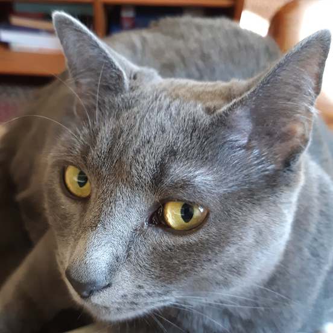
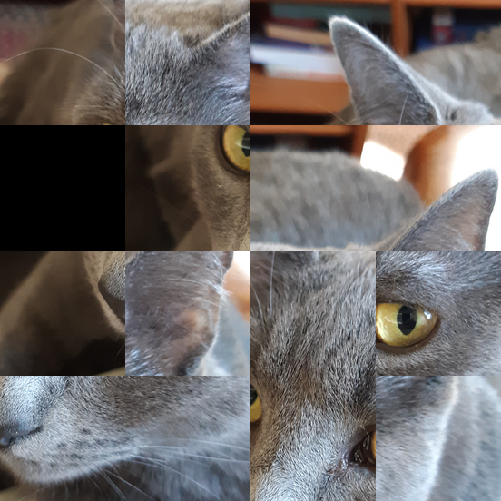
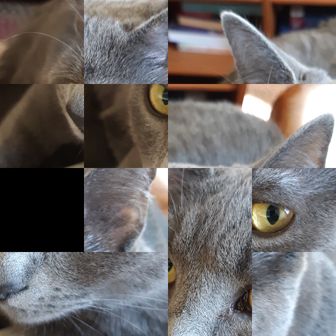
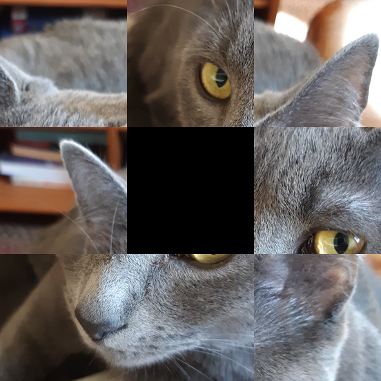

<div class='admonition caution'>
<div class='title'>Caution</div>
<div class='content'>
<ul>
<li>You are expected to work in pairs.</li>
<li><strong>Due: Wednesday, October 25th at 11pm EST (Baltimore time).</strong></li>
<li><em>This assignment is worth 140 points.</em></li>
<li>Late submissions will <b>not</b> be accepted! Please plan accordingly</li>
</ul>
</div>
</div>

<div class='admonition success'>
<div class='title'>Objectives</div>
<div class='content'>
<ul>
<li>structs</li>
<li>binary file I/O</li>
<li>nested loops</li>
<li>data representations</li>
<li>dynamic memory allocation</li>
<li>makefile</li>
<li>development tools <code>gdb</code>, <code>valgrind</code>, <code>git</code></li>
<li>unit tests</li>
</ul>
</div>
</div>

# Overview

In this project, you will implement a program to perform operations
on a [15 Puzzle](https://en.wikipedia.org/wiki/15_puzzle), which is
a puzzle consisting of a square grid of tiles with one tile missing.
By sliding a tile into the "gap" left by the missing tile, the tiles
can be moved around. The goal is to rearrange the tiles so that each
one is in the correct position.

The program will read and carry out a series of commands. The commands
can be used to

* create a new puzzle
* set an initial configuration of tiles
* load a background image (to use when writing images that
  represent the state of the puzzle)
* slide tiles to manipulate the configuration of the puzzle
* check whether or not the puzzle has been solved
* compute a series of moves that will solve the puzzle
  (if a solution is possible)

# Getting Started

After you register your project team, or are assigned to a project team,
we will create a Github repository for your team to use. You should see
the repository listed when you visit <https://github.com/orgs/jhu-ip/repositories>
(assuming that you are logged into Github.) The repository will have
a name like `2023-fall-midterm-JHEDID1-JHEDID2` where `JHEDID1` and
`JHEDID2` are your and your partner's JHED IDs.

Clone your team repository with the commnad

```
git clone git@github.com:jhu-ip/2023-fall-midterm-JHEDID1-JHEDID2.git
```

replacing `JHEDID1` and `JHEDID2` as appropriate.

Next, change directory to the directory containing your clone of the
course public repository (e.g., `cd ~/cs220-f23-public`), and run the command

```
git pull
```

This will ensure that you have the latest files in the public repository,
including the starter files for the midterm project.  Then, change
directory into your clone of your team repository, and run the commands

```
cp -r ~/cs220-f23-public/projects/midterm/* .
cp ~/cs220-f23-public/projects/midterm/.gitignore .
```

to copy the starter files to your team repository. Finally, use
`git add` and `git commit` to add an commit the starter code
(don't forget to add and commit the `.gitignore` file), and then
use `git push` to push the commit to the remote repository on Github.
Note that only one team member needs to add/commit/push the starter
files.

## Example of Program Functionality

This section shows a quick example of how the program works.

The example input shown here is in the file `test06.txt` included in
the starter files, so the following invocation could be used to run the
program with this input:

```
./puzzle test06.txt
```

The input file `test06.txt` has the following contents:

```
C 4
T 5 7 1 2 0 9 3 4 13 8 6 11 14 15 10 12
I ingo.ppm
W ingo_scrambled.ppm ingo_scrambled.txt
S l
S u
S l
S l
S r
S d
S r
S d
S l
S l
S u
S r
S u
S u
S r
S r
S d
S d
S d
S l
S l
S u
S r
S u
S l
S l
S u
W ingo_solved.ppm ingo_solved.txt
```

The meaning of each of these commands is fully described in the
[Input Format](#input-format) section below. However, here is
a brief summary of what this input does:

1. Specifies that the puzzle is 4x4 (the `C` command)
2. Specifies a particular arrangement of tiles (the `T` command and
   the numbers that follow it)
3. Specifies that `ingo.ppm` is the background image for the puzzle
   (the `I` command)
4. Saves the initial (scrambled) configuration of the puzzle to image
   `ingo_scrambled.ppm` and text file `ingo_scrambled.txt` (the first `W` command)
5. Performs a series of moves (the `S` commands)
6. Saves the final solved configuration of the puzzle to the image
   `ingo_solved.ppm` and text file `ingo_solved.txt`
   (the second `W` command)

This is the background image (`ingo.ppm`):

<div class="puzzle_layout">
<a href="img/ingo.png"></a>
</div>

This is the initial scrambled puzzle configuration (the image is
`ingo_scrambled.ppm`):

<div class="puzzle_layout">
<table class="puzzle">
 <tr>
  <td>5</td><td>7</td><td>1</td><td>2</td>
 </tr>
 <tr>
  <td class="gap"></td><td>9</td><td>3</td><td>4</td>
 </tr>
 <tr>
  <td>13</td><td>8</td><td>6</td><td>11</td>
 </tr>
 <tr>
  <td>14</td><td>15</td><td>10</td><td>12</td>
 </tr>
</table>
<a href="img/ingo_scrambled.png"></a>
</div>

After all of the "S" commands complete, the puzzle is in its
"solved" configuration (the image is `ingo_solved.ppm`):

<div class="puzzle_layout">
<table class="puzzle">
 <tr>
  <td>1</td><td>2</td><td>3</td><td>4</td>
 </tr>
 <tr>
  <td>5</td><td>6</td><td>7</td><td>8</td>
 </tr>
 <tr>
  <td>9</td><td>10</td><td>11</td><td>12</td>
 </tr>
 <tr>
  <td>13</td><td>14</td><td>15</td><td class="gap"></td>
 </tr>
</table>
<a href="img/ingo_solved.png"></a>
</div>

# Program Requirements

## Program Structure, Data Types

The header file `puzzle.h` should have all of the common struct data types
and function declarations for the overall program.

The header file should define a struct data type called `Puzzle`.
An instance of this data type represents the current configuration
of the puzzle (it's size and the arrangements of the tiles.)
This data type can be defined something like this:

```c
typedef struct {
  // ...fields go here...
} Puzzle;
```

Puzzles will always be square, meaning that the number of rows
and columns will always be the same.  Each tile can be represented
by an integer value in the range $$1..N^{2}$$ (inclusive), where
$$N$$ is the number of rows/columns.  The value $$0$$ represents
the "gap" (missing tile).  A valid initialized puzzle should always
have exactly one gap tile. By convention, puzzles will omit
the tile numbered $$N^{2}$$, meaning that in a solved puzzle, the
gap will be in the lower right. However, your program should not
hard-code this assumption. In other words, your program must be able
to correctly handle puzzles where, when the puzzle is solved, the
gap is not in the lower-right corner.

Your program is required to use functions to modularize the
overall functionality of the program. In particular, your program
should have a set of functions for creating, performing operations
on, and destroying instances of the `Puzzle` data type.
There are no specific requirements for which functions you implement
or how they work. However, here are a few suggestions which
you may use (or choose not to use):

```c
Puzzle *puzzle_create(int size);
void puzzle_destroy(Puzzle *p);
void puzzle_set_tile(Puzzle *p, int col, int row, int value);
int puzzle_get_tile(const Puzzle *p, int col, int row);
```

We also expect you to use functions to modularize the implementation
of the variuos commands suppored in the [Input Format](#input-format).
For example (again, you may use these or choose not to):

```c
int handle_C_command(FILE *in, Puzzle **p);
int handle_T_command(FILE *in, Puzzle *p);
```

The source file `puzzle_funcs.c` should contain the definitions of
the functions defined in `puzzle.h`.  The source file `puzzle.c` should
define the program's `main` function.

Your program will use the [PPM image format](https://en.wikipedia.org/wiki/Netpbm).
The starter code provides you with files `ppm_io.h` and `ppm_io.c`.
The `ppm_io.h` header file defines a struct type named `Image` which
represents an image. Functions `ReadImage` and `WriteImage` support
reading and writing PPM image data, respectively.
(See the [Reading and Writing PPM Files](#reading-and-writing-ppm-files)
section for more information.)

## Input Format

The input to the program (either read from a named file or read from
`stdin`) is a series of commands.  Each command consists of a capital
letter. Some specific commands also require argument values which follow
the command letter.

Here is a list of commands and their arguments:

Command | Description
------- | -----------
<code class='highlighter-rouge'>C <i>size</i></code> | Create initial puzzle with <i>size</i> rows and columns
<code class='highlighter-rouge'>T <i>tile...</i></code> | Initialize puzzle configuration with series of tile numbers
<code class='highlighter-rouge'>I <i>filename</i></code> | Load the background image from specified PPM file
<code class='highlighter-rouge'>P</code> | Print sequence of tile numbers reflecting current puzzle configuration
<code class='highlighter-rouge'>W <i>filename1</i> <i>filename2</i></code> | Write puzzle image to <i>filename1</i> and puzzle configuration to <i>filename2</i>
<code class='highlighter-rouge'>S <i>direction</i></code> | Slide a free tile in specified direction
<code class='highlighter-rouge'>K</code> | Check to see whether the puzzle is in the "winning" configuration
<code class='highlighter-rouge'>V</code> | Compute a series of moves to solve the puzzle
<code class='highlighter-rouge'>Q</code> | Quit the program

The `C` command creates the initial instance of the puzzle. The <i>size</i>
argument must be an integer in the range 2 to 20, inclusive, which specifies
the number of rows and columns. Each position in the puzzle must
be initialized with the value of the "gap". This means that the
puzzle is not "valid" until it has been explicitly initialized
with the `T` command.

The `T` command initializes the puzzle by assigning either a tile number
or the gap to each position. The <i>tile...</i> argument is a sequence
of integers in the range $$0 \ldots N^{2}$$ (inclusive) where $$N$$ is the
number of rows/columns with the value $$0$$ representing the gap. The numbers
specify the puzzle configuration in row major order. There must be
exactly $$N^{2}$$ tile numbers. The `T` command
must be specified *after* the `C` command creating the puzzle.

The `I` command reads a PPM file from the specified filename. This iamge
will be used as the "background" image, and is the basis for the rendering
of the current puzzle configuration as an image performed by the
`W` command.

The `P` command prints the current puzzle configuration to `stdout` as a
sequence of integer values. The format is exactly the same as the
<i>tile...</i> sequence specified in the `T` command, but should reflect
the current puzzle configuration based on any `S` commands that have
been executed to update the configuration of the puzzle.
The output should be printed as a single line of text ending with
a newline (`\n`) character.

The `W` command writes two output files, their names being specified
by the <i>filename1</i> and <i>filename2</i> arguments. The first
filename is the name of a PPM image file to be created as a rendering
of the current puzzle configuration. The gap should be rendered as
consisting of exclusively black pixels (with the red, green, and blue
color components being set to 0.) The other tiles should be copied from
the appropriate rectangular region of the background image loaded previously
with the `I` command. The background image is expected to have width
and height which are both exact multiples of the number of rows/columns
in the puzzle. The second filename is the name of a text file to
write with the current puzzle configuration, in exactly the same format as
the output written to `stdout` by the `P` command.

The `S` command slides the "free" tile in the direction specified by the
*dir* argument, which is one of the characters `u` (up), `d` (down), `l` (left),
or `r` (right). The "free" tile to be moved is the one adjacent to the single
gap position that is free to move into the gap. As an illustration of the
behavior of the `S` command, consider the following puzzle configuration
(the initial configuration from the
[Example of Program Functionality](#example-of-program-functionality) section):

<div class="puzzle_layout">
<table class="puzzle">
 <tr>
  <td>5</td><td>7</td><td>1</td><td>2</td>
 </tr>
 <tr>
  <td class="gap"></td><td>9</td><td>3</td><td>4</td>
 </tr>
 <tr>
  <td>13</td><td>8</td><td>6</td><td>11</td>
 </tr>
 <tr>
  <td>14</td><td>15</td><td>10</td><td>12</td>
 </tr>
</table>
<a href="img/ingo_scrambled.png"></a>
</div>

If the command `S u` is executed, the tile immediately *below* the
gap (tile 13) is moved up, resulting in this configuration;

<div class="puzzle_layout">
<table class="puzzle">
 <tr>
  <td>5</td><td>7</td><td>1</td><td>2</td>
 </tr>
 <tr>
  <td>13</td><td>9</td><td>3</td><td>4</td>
 </tr>
 <tr>
  <td class="gap"></td><td>8</td><td>6</td><td>11</td>
 </tr>
 <tr>
  <td>14</td><td>15</td><td>10</td><td>12</td>
 </tr>
</table>
<a href="img/ingo_S_up.png"></a>
</div>

Note that because the gap is on the left edge of the puzzle, the `S r` command
would not be legal, because there is no free tile to the left of the gap to move
to the right.

The `K` command checks to see whether the current puzzle configuration
is the "solved" configuration. A puzzle is considered solved if every
non-gap tile is in its expected position. For example, tile 1 should
be in the upper-left position, tile 2 should be immediate to its right,
etc. Based on whether or not the puzzle is solved, the program
should print either the output "`Solved`" or "`Not solved`" as
a single line of text ending with a newline (`\n`) character.

The `V` command computes a series of moves which solve the puzzle,
if the puzzle can be solved. The solution should be printed as a series
of `S` commands.  For example, if the current puzzle configuration looks like
this (note that this is a 3x3 puzzle):

<div class="puzzle_layout">
<a href="img/ingo_scrambled_3_test08.png"></a>
</div>

Then the output of the `V` command might be

```
S d
S r
S u
S l
S l
S u
```

See the [Solving the Puzzle](#solving-the-puzzle) section for a discussion
of how to implement an algorithm to search for a solution.
Note that your program is not required to find a *specific* solution
to solve the puzzle. It just needs to find a *valid* solution.

If a solution can't be found, the program should print the output
"`No solution found`" as a single line of text (ending with a newline.)

The `Q` command quits the program. The program should exit with an
exit code of 0 when the `Q` command is executed.

For the `I` and `W` commands, you can assume that a filename will not consist of more
than 255 characters.

If the input ends without an explicit "`Q`" command — i.e., if the program
tries to read a command but instead reaches the end of the input data — it
should exit normally (with an exit code of 0.)

## Running the Program

The program executable should be named "`puzzle`".

There are two ways to invoke the program. If invoked without command line
arguments,

```
./puzzle
```

then the program should read commands from `stdin`.

If the program is invoked with a single argument, e.g.

```
./puzzle input.txt
```

then the program should read commands from the file named by the
command line argument.

## Error Handling

There are two kinds of situations where an error occurs:

* The program is not able to read a well-formed command
  (e.g., the command letter is invalid, a required argument
  is missing or invalid, etc.)
* The program cannot carry out a command that has been
  successfully read

When an error is encountered, the program must

1. Print an error message to `stderr`
2. Exit the program with an exit code of 1

Note that there are no "recoverable" errors. I.e., if an error occurs,
the program does not continue reading commands.

This table summarizes the errors that should be handled, and the
error message that should be printed:

Situation | Could occur in | Message text
--------- | -------------- | ------------
Invalid command letter | Reading a command | <code class='highlighter-rouge'>Invalid command '<i>character</i>'</code>
Missing/invalid command argument | `C`, `T`, `I`, `W` `S` commands | <code class='highlighter-rouge'>Invalid input</code>
Invalid puzzle size | `C` command | <code class='highlighter-rouge'>Invalid puzzle size</code>
Puzzle has not been created   | `T`, `P`, `W`, `K`, `V` commands | <code class='highlighter-rouge'>No puzzle</code>
Invalid tile value | `T` command | <code class='highlighter-rouge'>Invalid tile value</code>
Could not open background image  | `I` command | <code class='highlighter-rouge'>Could not open image file '<i>filename</i>'</code>
Background image hasn't been read | `W` command | <code class='highlighter-rouge'>No image</code>
Background image rows or columns not evenly divisible by puzzle rows/columns | `W` command | <code class='highlighter-rouge'>Invalid image dimensions</code>
Output image file can't be opened | `W` command | <code class='highlighter-rouge'>Could not open output image file '<i>filename</i>'</code>
Output puzzle configuration file can't be opened | `W` command | <code class='highlighter-rouge'>Could not open output puzzle file '<i>filename</i>'</code>
Puzzle configuration data isn't written successfully | `W` command | <code class='highlighter-rouge'>Could not write puzzle data '<i>filename</i>'</code>
There isn't a free tile that can be moved in specified direction | `S` command | <code class='highlighter-rouge'>Puzzle cannot be moved in specified direction</code>

Some of the error messages have values to be filled in:

* *character*: for an invalid command, the character entered as the command name
* *filename*: if an error involves a file, the filename

The error message must be printed on a single line (terminated with
a newline), and must have the exact text (with suitable values filled in)
as specified in the table.

As a special case, if `ReadPPM` fails to successfully read PPM data, or
`WritePPM` fails to successfully write PPM data, those functions will
print their own error messages. If this occurs, the `puzzle` program
shouldn't print any additional error message, but should exit with exit
code 1.

## Solving the Puzzle

This section describes the type of algorithm you should implement to handle
the `V` command (to compute a sequence of moves to solve the puzzle.)

<div class='admonition caution'>
<div class='title'>Caution</div>
<div class='content'>
<p>
  Solving the puzzle will involve an algorithm with an exponential running
  time. For this reason, we will only expect your program's
  <code class='highlighter-rouge'>V</code> command
  to work if the puzzle size is 3x3 (an "8-puzzle".)
</p>
</div>
</div>

You can implement a computation to find a solution to the puzzle using
a branching recursive search strategy somewhat similar to the regular
expression matching algorithm you implemented in [Homework 3](hw3.html).

This algorithm is described by the following pseudo-code:

```
// Parameters:
//   p - a Puzzle
//   steps - array of directions (u/d/l/r)
//   max_steps - maximum number of steps to try
//   cur_steps - how many steps have been considered so far

function solve_puzzle(p, steps[], max_steps, cur_steps) {
  if (p is solved)
    return cur_steps   // steps array has a complete sequence of steps

  if (cur_steps >= max_steps)
    return FAILURE     // we reached the max number of steps

  for direction in 'u', 'd', 'l', 'r' {
    copy = make copy of p
    if (attempt to carry out move in direction on copy succeeds) {
      if (recursive call to solve_puzzle on copy succeeds) {
        // found a solution recursively!
        place direction in appropriate element of steps array
        return number of steps in recursive solution
      }
    }
  }

  return FAILURE    // attempts to solve recursively did not succeed
}
```

Note that the algorithm described above is a completely brute-force
approach. There are a couple of ways to enhance the algorithm that could
be helpful.

First, we probably don't want to consider moves in a direction that is
the opposite of the direction in the previous move. For example, it would
be silly to consider a `d` move if the previous move was `u`.
This could be addressed by adding a parameter to indicate what the previous
move direction was (if any, since the first move considered won't have
a previous move.)

Second, rather than hard-coding the order of the directions considered,
the algorithm could use a heuristic to rank the candidates. One way to
approach this would be to first create the candidate puzzle copies
corresponding moves in each direction, and then analyze each candidate to
determine how "close" it is to a complete solution. For example,
you could compute the sum of the [Manhattan Distance](https://en.wikipedia.org/wiki/Taxicab_geometry)s
of each tile from where they would be located in the solution.
The algorithm would then try to find recursive solutions by starting with
the "best" candidate (i.e., closest to a solution), and if no solution
can be found in that candidate, proceed to the next best candidate, etc.

Note that this algorithm will return the *first* solution it finds,
which is not necessarily the *best* solution. You may want to start
by restricting the search to find a "short" solution, and then gradually
easing this restriction.

## Reading and Writing PPM Files

The `ppm_io.h` and `ppm_io.c` header and source files implement support
for reading and writing [PPM](https://en.wikipedia.org/wiki/Netpbm)
image files. You should read the code in these files so that you
understand how they work.

The `ppm_io.h` header defines the following data types:

```c
typedef struct _pixel {
  unsigned char r;
  unsigned char g;
  unsigned char b;
} Pixel;

typedef struct _image {
  Pixel *data;  // pointer to array of Pixels
  int rows;     // number of rows of Pixels
  int cols;     // number of columns of Pixels
} Image;
```

The `Pixel` data type represents the color of one pixel in an image.
A pixel color is defined by its red, green, and blue color component
values, which are intgers in the range 0 to 255, inclusive.
A color component value represents an intensity, with 0 being least
intense and 255 being most intense.

The `Image` data type represents an image, which is a rectangular grid
of pixels. The `rows` and `cols` member variables indicate how many rows
and columns of pixels there are. The `data` member variable points to
a dynamically-allocated array of `Pixel` elements representing the
pixels in the image in row-major order. Note that computer images
consider the origin (row 0, column 0) to be the upper-left corner of
the image. In general, the pixels are stored row by row in the array
that `data` points to, with the first row being the top row of pixels
in the image.

The `ReadPPM` and `WritePPM` are used to read a PPM image (creating an
instance of the `Image` data type) and write a PPM image (from an existing
instance of the `Image` data type), respectively.

Note that in your implementation of the `W` command, you will need to
create a new `Image` instance in memory, and fill in its member variables
appropriately.  This code could look something like this:

```c
Image *img;

img = /* dynamically allocate memory for an instance of Image */;
img->data = /* dymamically allocate array of Pixel elements */;
img->rows = /* number of rows of pixels */;
img->cols = /* number of columns of pixels */;
```

## Memory Correctness, Closing Files

Your program should be free from memory errors, including

* Out of bounds array accesses
* Invalid pointer dereferences
* Memory leaks

We also expect that any file opened by the program will be closed
before the program exits.

Make sure that you are using `valgrind` frequently: it can detect both
memory errors and unclosed files if you run it with the options

```
--leak-check=full --show-leak-kinds=all
```

## Testing

### Viewing Image Files

Since your `puzzle` program will not have a GUI, you will use external
programs to view the images. If you are on ugrad (either locally, or
remotely with X-tunnelling), you can use the program `feh`.

<div class='admonition info'>
<div class='title'>Info</div>
<div class='content'>
<p><code>feh</code> is a very simple command-line image viewer. It is
available on ugrad machines and you can simply run the program with the
name of an image file as a command-line argument, and it will display
the image on your screen. e.g.</p>
<div class="sourceCode" id="cb1"><pre class="sourceCode sh"><code class="sourceCode bash"><a class="sourceLine" id="cb1-1" title="1">$ <span class="ex">feh</span> myimage.ppm</a></code></pre></div>
<p><strong>Note:</strong> Before running <code>feh</code>, make sure
either Xming or Xquartz is running and x-tunneling is enabled (i.e. add
-Y on mac when you <code>ssh</code> in to ugrad. On Putty, enable x-11
forwarding option)</p>
<p>Note <a href="https://www.xquartz.org/">XQuartz</a> (Mac OS) and
<a href="https://sourceforge.net/projects/xming/">XMing</a> (Windows)
will need to be downloaded and installed before you can use them.</p>
</div>
</div>

If you are using a different platform, you are welcome to use an image
viewer of your choice; `feh` is easy to install using most linux package
managers, but there are other open source image viewing programs, as
well as alternatives for Windows and OSX.

Also note that Visual Studio Code has the capability to display image
files, which means if you're using VS Code, you likely won't need to
use an external image viewer program. Note that you will need
a VS Code extension to be able to view PPM images:

<a style="margin-left: 2em;" href="https://marketplace.visualstudio.com/items?itemName=ngtystr.ppm-pgm-viewer-for-vscode">https://marketplace.visualstudio.com/items?itemName=ngtystr.ppm-pgm-viewer-for-vscode</a>

### Example Inputs, Expected Outputs

The files `test01.txt` through `test09.txt` are example inputs.
The corresponding example outputs, generated image files, and
generated puzzle configuration files are found in the "`expected`"
directory. When you run your `puzzle` executable on the example
inputs, you can compare the generated outputs to the expected
files.  The `compare` and `diff` programs are useful for comparing
images and text files.  For example, here is a scenario in which
you could run your `puzzle` program on the `test06.txt` input
and compare the results (note that "`$`" is used to indicate
the command prompt, and the `compare` commands are on two lines,
with the `\` character being used as a line continuation):

```
$ ./puzzle test06.txt > test06_out.txt
$ diff expected/test06_out.txt test06_out.txt
$ compare expected/ingo_scrambled_test06.ppm ingo_scrambled_test06.ppm \
	ingo_scrambled_test06_diff.png
$ diff expected/ingo_scrambled_test06.txt ingo_scrambled_test06.txt
$ compare expected/ingo_solved_test06.ppm ingo_solved_test06.ppm \
	ingo_solved_test06_diff.ppm
$ diff expected/ingo_solved_test06.txt ingo_solved_test06.txt
```

If the `diff` and `compare` commands complete with no output, that
means your program's output matched the expected output.

Note that you will need to look at the input file (e.g., `test06.txt`)
in order to determine which output files are created by the test.

The `compare` program generates a "diff image" showing the pixels
that differ between the compared images. You can view this diff image
to determine where the pixels generated by your program differ from
the ones the expected result image.

<div class='admonition note'>
<div class='title'>Note</div>
<div class='content'>
<p>
  The <code class='highlighter-rouge'>test08.txt</code> input file uses
  the <code class='highlighter-rouge'>V</code> command. Since any correct
  solution is a valid output for this command, your program's output
  might differ from the "expected" output, but that doesn't necessarily
  mean that your program's output is incorrect.
</p>
</div>
</div>

### Unit Tests

Since you will be implementing functions to support the functionality of
the program, it's important to have confidence that those functions work
correctly. We encourage you to create a unit test program, similar to the
`test_functions` program you worked on for [Homework 3](hw3.html).

Here is an example of what a unit test program might look like:

```c
#include <stdio.h>
#include <stdlib.h>
#include <assert.h>
#include "puzzle.h"

// also tests puzzle_destroy
void test_puzzle_create(void) {
  Puzzle *p3 = puzzle_create(3);
  Puzzle *p5 = puzzle_create(5);

  assert(p3->size == 3);
  for (int i = 0; i < 9; ++i) {
    assert(p3->tiles[i] == 0);
  }

  assert(p5->size == 5);
  for (int i = 0; i < 25; ++i) {
    assert(p5->tiles[i] == 0);
  }

  puzzle_destroy(p3);
  puzzle_destroy(p5);
}

// also tests puzzle_get_tile
void test_puzzle_set_tile(void) {
  int init[4][4] = {
    { 5, 7, 1, 2 },
    { 13, 9, 3, 4 },
    { 0, 8, 6, 11 },
    { 14, 15, 10, 12 },
  };

  Puzzle *p4 = puzzle_create(4);
  for (int i = 0; i < 4; ++i)
    for (int j = 0; j < 4; ++j)
      puzzle_set_tile(p4, j, i, init[i][j]);

  for (int i = 0; i < 4; ++i)
    for (int j = 0; j < 4; ++j)
      assert(puzzle_get_tile(p4, j, i) == init[i][j]);

  puzzle_destroy(p4);
}

// ...other test functions...

int main(void) {
  test_puzzle_create();
  test_puzzle_set_tile();
  // ...call other test functions...

  printf("All tests passed!\n");
  return 0;
}
```

# Packaging, Submission

Make sure you declare your desire for an assigned teammate in the piazza thread @266. Also, you would need to complete an individual report form (instructions at the bottom of this section).

Your `Makefile` should have a target for the `puzzle` executable.
This target should be the default target of the `Makefile`.
Optionally, you can have a target for a test program for unit testing
your functions. While we highly recommend that you write unit tests,
it's not required.

You should include a `README` file listing the names and JHED IDs of the team members, as
well as a brief summary of the contributions of each team member.
You can also use the `README` to discuss anything interesting about
the implementation. If there was functionality that you weren't
able to get working, you should mention it here.

You will need to prepare a `gitlog.txt` listing the commits to the project
repository:

```
git log > gitlog.txt
```

When you submit your code to Gradescope, the files submitted should include

* all `.c` source files
* all `.h` header files
* the `Makefile`
* `gitlog.txt`
* the `README`

Do **not** include any PPM image files in your submission.

You could use the following command to generate your zipfile:

```
zip -9r solution.zip *.c *.h Makefile gitlog.txt README
```

When you upload to Gradescope, make sure each team member is added to the
submission.

There will be 5 project points associated with completing [this form](https://forms.gle/6ff9S3VtZRCdGPWf7) before Friday OCT 27th, 11pm. Note that the contents of the form you submit will not affect your partner's grade nor your own (other than the 5 project points you receive for completing this form on time). Please also note that people assigned to work in a group of three will need to submit two forms, one for each team member other than themselves.
