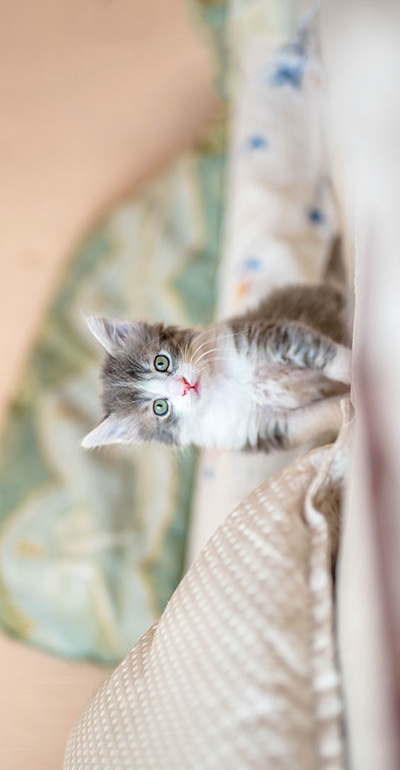

<div class='admonition caution'>
<div class='title'>Important Dates</div>
<div class='content'>
<ul>
<li>You are expected to work in a team of two.</li>
<li>Released: Wednesday Feb 28th</li>
<li><strong>Due: Friday March 15th at 11pm</strong></li>
<li>This project is worth 140 points</li>
<li>No late days may be used!</li>
</ul>
</div>
</div>

## Learning Objectives
<div class='admonition success'>
<div class='title'>Objectives</div>
<div class='content'>
<p>To practice with:</p>
<ul>
<li>structs</li>
<li>binary file I/O</li>
<li>data representations</li>
<li>dynamic memory allocation</li>
<li>random numbers</li>
<li>makefile</li>
<li>development tools `gdb`, `valgrind`, `git`</li>
</ul>
</div>
</div>

## General Requirements

This is a team of two programming assignment, meaning you and a partner will collaboratively write and submit the source code for a program. You and your partner should take a "paired programming" approach, where you frequently work together at a single screen. In this approach, at any given time one person is the "driver" with their hands on the keyboard, and the other is the "navigator" watching and guiding the driver. You should switch roles regularly. This method is particularly effective when you are testing and debugging your program. Remember, you are both responsible for all the code you submit and will receive the same grade.

As usual for coding assignments, you are required to use the `git` version control system and include a *log file* with your project submission. Both partners must make sigificant commits to the project.

<div class='admonition caution'>
<div class='title'>Project Repo</div>
<div class='content'>
We will provision you a separate repo for your midterm project under the `jhu-ip` organization and both team members along with course staff will be invited to have an admin role on the repo. You will both need to clone this new repo to get started. You should anticipate some conflicts when sharing a repo, and will need to resolve and merge them appropriately. Frequent commit/push/pull sequences are even more important in this situation.
</div>
</div>

This project is larger and more complex than previous programming assignments. Additionally, since you have now been exposed to most of what C can do, there are no restrictions on what language features you can use (other than the conventions of good style, of course; you still shouldn't use global variables, for example).


<div class='admonition danger'>
<div class='title'>Note</div>
<div class='content'>
From this point forward in the semester, your programs will need to not only compile and run cleanly (i.e. with no warnings, errors, or crashes), but also must not have any memory-related issues (as reported by valgrind).
</div>
</div>

## Program Description

This program will be an image processing program, in the vein of Photoshop. It will have a command-line-based user interface (UI), so there will be no graphical interface, and the range of operations will be limited, but the algorithms you will use are similar to the ones used in programs like Photoshop or GIMP.

At a basic level, your program will be able to read image files from disk, perform one of a variety of image processing tasks, and then write the result back to disk as a new image file. Since your program will not have a GUI, you will use external programs to view the images. If you are on ugrad (either locally, or remotely with X-tunnelling), you can use the program `feh`.

<div class='admonition tip'>
<div class='title'>Viewing Images</div>
<div class='content'>
<p>For this project, you will be working with images in a PPM formt (described below). This means that you will want to view images, which means that in order to work remotely on the ugrad machines, you will need to set up X-tunnelling using <a href="https://sourceforge.net/projects/xming/">XMING</a> on Windows or <a href="https://www.xquartz.org/">XQuartz</a> on Mac (Reach out to us if you need help to set this up). Also, PPM images can be quite large; be aware of file sizes, and try not to fill up your hard drive (or your disk quota on ugrad) with thousands of cat pictures...</p>
<p>
`feh` is a very simple command-line image viewer.  It is available on ugrad machines and you can simply run the program with the name of an image file as a command-line argument, and it will display the image on your screen. e.g.
</p>
<p>
<code>$ feh myimage.ppm</code>
</p>

<strong>Note:</strong> Before running `feh`, make sure either Xming or Xquartz is running and x-tunneling is enabled (i.e. add -Y on mac when you `ssh` in to ugard. On Putty, enable x-11 forwarding option)
</div>
</div>

If you are using a different platform, you are welcome to use an image viewer of your choice; `feh` is easy to install using most linux package managers, but there are other open source image viewing programs, as well as alternatives for Windows and MacOSx.

While there are many formats for storing image files, your program will **only** need to read and write one, the **PPM** format. This is essentially the simplest and easiest format to read and write, which is why it was chosen; its main drawback is that it does not use any kind of compression, so images stored in this format tend to be on the large side when compared to formats like JPEG or PNG or GIF. An implementation to read and PPM files is provided for you. However, you will need to write the corresponding method to write to a PPM file format. (See `ppm_io.h` and `ppm_io.c` in the starter code.)

<div class='admonition caution'>
<div class='title'>Starter Files</div>
<div class='content'>
<p>Make sure to do a `git pull` on the public repo before starting to work to get the starter files for this project. You must work with the starter files!</p>
</div>
</div>

### PPM image format

For this assignment, we will use a very simple image-file format called PPM. It's an uncompressed format, meaning that the images will take up a lot of disk space (compared to JPG or PNG files), but it's very easy to read and write from C code (which is why we're using it). For the formal "official" description of the PPM format, see the [netpbm site](http://netpbm.sourceforge.net/).

<div class='admonition success'>
<div class='title'>'convert' Command</div>
<div class='content'>
<p>
NOTE: you can use a unix program called `convert` to convert between image formats; e.g. to convert an existing file called "selfie.jpg" into a PPM, you would type:
</p>
<p>
<code>$ convert selfie.jpg selfie.ppm</code>
</p>
<p>
This works for most image format file extensions; it converts to/from most known image formats, including .jpg, .gif, .png, .ppm, .tiff, and .pdf, and is installed on the ugrad machines. If it's not installed on your local machine (or virtual machine), most linux package managers can install it (or can install ImageMagick, which is the suite of tools that `convert` is part of).
</p>
</div>
</div>

The PPM format itself is pretty simple (compared to most other image formats). Basically, at the top of the file will be a special "tag" that marks the file as a PPM; this should be P6. Then, there are three numbers, separated by whitespace; these numbers represent the size of the image as columns, rows, and colors. Columns and rows specify the width and height of the image (in pixels) respectively. (BEWARE: columns come before rows in this format!) Colors encodes how many different shades of each color a pixel can take on; for this assignment, this number must always be 255 (you must reject any image that uses a different value, but you're unlikely to encounter one). Immediately after the 255, the binary data encoding pixels will begin.

Optionally, there may be lines starting with a #, which are comments and should be ignored; these may be intermixed with the above information. You don't need to store these; if you read a file and then re-write it, it's fine if the comments get lost. The files we test your code with, however, will have either 0 or 1 comment lines just after the P6 tag, but no comment lines between the other header values (see `trees.ppm` in the course public repo for an example).

All of this will be ANSI text, so you can use the normal text functions (e.g. fgetc(), fscanf(), fprintf() etc.) to read/write the header information.

After the color size specification, there will be a single whitespace character (usually a newline, but that's not guaranteed), after which the remainder of the file will be the actual pixel values. Basically, each "pixel" consists of three values; the first value is the "red" channel, the second value is the "green" channel, and the third value is the "blue" value. Taken together, these three values specify a single color, which is the RGB color value of that pixel. Since the max color value is 255, each of these values will be in the range 0-255, which fits exactly in one byte of memory. For more information about RGB color codes see [Wikipedia](https://en.wikipedia.org/wiki/RGB_color_model).

The easiest way to read the pixel values is to create a struct that contains three unsigned char variables, one per color channel. Then, create an array of your pixel structs with rows * cols elements. At that point, you can just use fread() to read the entire array of pixels from the file in one go. Similarly, you can use fwrite() to write the whole pixel array with a single function call. We've started this off for you in the provided ppm_io.h and ppm_io.c files.

Your first coding task for this project is to write a few of the functions in the `ppm_io.c` implememtation file: `write_ppm`, `make_image`, and `free_image`. We have provided implememtations of `read_ppm`.


## Operational Overview

Your program will be a command line tool, always run with the name of the executable file project followed by the name of an input PPM file, the name of a desired output PPM file, and the specific lower-case name of an image processing operation, as listed below. Some operations require additional arguments, which will also be supplied at the command line by the user, at the end of the line. There is no input entered by the user interactively.

<div class='admonition info'>
<div class='title'>First Two Commandline Args</div>
<div class='content'>
Regardless of the desired operation, the first two arguments after the executable name project are always interpreted as the input file name followed by the output file name. The next argument is always interpreted as the operation name, and the operation's arguments (if any) come after that.
</div>
</div>

The operations your program will be able to recognize and perform are all of the following (the bolded words are the operation names to be entered at the command line by the user):

1. [**grayscale**](#grayscale) - convert the input image to grayscale (i.e. a full-color image becames shades of gray)
2. [**blend**](#blend) - blend two images into one using an `alpha` factor
3. [**rotate-ccw**](#rotate-ccw) - rotate the input image 90 degrees counter-clockwise
4. [**pointilism**](#pointilism) - apply a pointilist filter to the input
5. [**blur**](#blur) - blur the image using a Gaussian filter with a prescribed standard deviation `sigma`
6. [**saturate**](#saturate) - increase/decrease the saturation of the image by a factor of `scale`

For example, at the command prompt, a user of your program might type:

```sh
$ ./project trees.ppm trees_blur.ppm blur 3
```

to blur the input image `trees.ppm` (in PPM format) and output the blurred image to `trees_blur.ppm`, where `3` specifies the standard deviation of the Gaussian filter.

Once you implement the missing ppm_io.c functions, you can then checkout the provided demo program `checkerboard`. Compile the demo program by running `make checkerboard`; an executable `checkerboard` should be generated. The program demonstrates how to use `ppm_io` to read and write PPM formated files, and also shows how the `struct Pixel` and `struct Image` are used.

<div class='admonition success'>
<div class='title'>Compare</div>
<div class='content'>
<p>
In the starter code, we also provide a helper executable `img_cmp`, which you could run on ugrad machine to compare if two PPM files are the same up to a tolerance.  It's usage is:
</p>

<code>$ ./img_cmp PPM file1 PPM file2 [tolerance = 0]</code>

<p>
The program takes two PPM files with the same dimension and compares them pixel by pixel.
It counts how many pairs of pixels are within the given tolerance.
A pair of pixels (with same row and col indices) of two images is said within the tolerance if each absolute difference of their three channel values is less than or equal to the tolerance.
For example, if you run:
</p>

<p>
<code>$ ./img_cmp checkerboard1.ppm checkerboard2.ppm 5</code>
</p>

it should tell you how many pair of pixels in `checkerboard1.ppm` and `checkerboard2.ppm` have an absolute difference of more than 5 (i.e. intensity difference).
</div>
</div>

After you have checked out `checkerboard.c` and `ppm_io.h`, and completed the `ppm_io.c` file, as an initial test to be sure you're on the right track, try to read in a PPM file and write it out unchanged.  Use the `img_cmp` program to verify the two files are the same. Once this works well, begin successively working through the other commands as listed.

## Development Plan
For this project, the development plan is largely in your hands. You are required to create a Makefile and submit it for this project, and the main executable it generates should be named `project`. You should also rigorously test your code, but you are not required to hand in specific tests with your submission. Beyond that, it is largely up to you how to structure your project, and what order to implement features in, but you **must take a modular approach**.

We recommend that you break your code into several files, and have as little code as possible in main(). Here is a suggested (but not required) breakdown of features into files:

- `Makefile` -  you **must** include a `Makefile` that can build your program; it's how the graders will compile your submission. You are required to build a target whose name is `project`.
- `project.c` - the main program. The `main()` function should be extremely simple; it might literally call a single function, then return 0. A `project.c` with a mostly empty `main()` and a `print_usage` helper function is provided in the starter code.
- `ppm_io.c` - contains implementations of functions for reading, creating, etc. images (using the PPM format). In the starter code, reading PPM files is provided for you. You must implement the missing functions `write_ppm`, `make_image`, and `free_image`. You may add other general-purpose image processing functions to this file.
- `ppm_io.h` - the header file for PPM I/O stuff (struct and function declarations).
- `image_manip.c` - where you will implement all image processing operations.
- `image_manip.h` - the header file for the image processing stuff.

<div class='admonition info'>
<div class='title'>Files</div>
<div class='content'>
<p>The list above is not a list of ALL files that should be included in your submission.  It is only a minimal listing of source code files.</p>
</div>
</div>

We recommend that before you start coding, you make a **development plan**. This means that you sit down and plan out (on paper) how you will break the program down into modules (e.g. functions or groups of functions), what each module will do, and how they will interact. You should also plan who/when/how each will be coded, leaving yourselves a week for debugging!

<div class='admonition tip'>
<div class='title'>Good Practices</div>
<div class='content'>
<p>Aim to write small, clean helper functions for better readability and easier testing, as well as greater reusability. Then, make a plan for what order you will implement the modules in. You will also want to test your modules; it's a good idea to use test-driven design, which means that you will design tests for your functions before you actually start trying to write the functions themselves.</p>
</div>
</div>

For each module, it's important to think about precisely what it should do, and also how you can test it to be sure it's doing what you want. There are lots of ways of testing your code; for this project, a lot of your tests will likely involve the visual inspection of output images to see if they look the way they're supposed to. Still, having an idea of how you'll test each piece before you start writing it (and then testing/fixing it before you move on to the next one) will make your life a lot easier.

<div class='admonition success'>
<div class='title'>Comparing Images</div>
<div class='content'>
<p>Some results images are provided in the starter code under `results` folder. If you like, you can use the `img_cmp` program to compare your results with them.</p>
</div>
</div>

### Scaffolding Folder
The scaffolding (i.e. starter code) folder for this project (available in the public repository) provides you with `ppm_io.c`, `ppm_io.h`, `checkerboard.c`, `project.c`, `img_cmp.c`, and a `Makefile` for the project. It also contains some testing PPM files in a folder named `data` and some expected results in a subfolder named `results`, which is in the PPM format. Lastly, we provide starter files `image_manip.h` and `image_manip.c` which is where your implementations of the various transformation operations should be added.

<div class='admonition info'>
<div class='title'>Note</div>
<div class='content'>
<p>Note that the results displaying on this page are png versions. You should use the provided PPM ones for comparison.</p>
</div>
</div>


We encourage you to store the provided PPM images and all created images in a subfolder of your own repository named data, to keep your images separate from your source code files. You don't need to submit any PPM files to us; keeping them in a separate folder will help you avoid accidentally including them.

<div class='admonition tip'>
<div class='title'>Tip</div>
<div class='content'>
<p>If you're using the `data` subfolder, we suggest you to execute your code from within the `data` folder by typing <code>../project</code>, so you can refer to input filenames while the program is executing directly as `kitten.ppm`, rather than `data/kitten.ppm`, saving yourself the extra typing while testing.</p>
</div>
</div>

## Error Reporting
The approach your program will take for error reporting is to have your `main()` method return a `0` value indicating success or a positive value indicating failure. Which positive value your program should return is indicated in the table below. If more than one error condition occurs, your program should return the error code listed earliest in the table below.

In addition to returning the specified value, your program should also output an informative error message to stderr. (The text of the error messages will not be specified; we'll leave the exact wording up to you.)

| Return value | Error condition it signifies |
|--------------|------------------------------|
| 0 | No errors detected |
| 1 | Wrong usage (i.e. mandatory arguments are not provided) |
| 2 | Input file I/O error |
| 3 | The Input file cannot be read as a PPM file |
| 4 | Unsupported image processing operations |
| 5 | Incorrect number of arguments for the specified operation |
| 6 | Invalid arguments for the specified operation |
| 7 | Output file I/O error |
| 8 | Other errors not specified above |

## Implementation Details

This section contains detailed descriptions of the image processing operations and the like that will be necessary for this assignment. We use the following sample image for all the all examples/operations illustrated below.

||
|:--:|
|The original kitten image|


||
|:--:|
|The original trees image|

### Grayscale

This is a fairly simple operation, but it does require a little math. Basically, for each pixel, you will calculate a single
 value based on the three color values (
 ,
  and
  ), and then assign that same value to all three color channels (if all three color channels have the same value, you know the pixel will show up as some shade of gray). For this program, we will use the NTSC standard conversion formula:


If you look around online, you will discover that there are actually several different formulas that can be used, which result in slightly different results; please use the NTSC version for this assignment (see Wikipedia on grayscale conversion).

<div class='admonition tip'>
<div class='title'>Tip</div>
<div class='content'>
Once the value is calculated, you will need to cast it back to an unsigned char before you assign it to each channel.
</div>
</div>

If you apply the grayscale to transform the kitten.ppm image by running the following command:

```
./project kitten.ppm kitten_grayscale.ppm grayscale
```

the result should look like:

||
|:--:|
|The grayscale kitten image|

### Blend

Blending two images is straightforward. The idea is, for each pixel, multiply each of the color channel values of the first image by the given factor 'alpha' and add it to the corresponding color channel value of the second image mutiplied by 1-alpha.

<div class='admonition info'>
<div class='title'>Important Notes</div>
<div class='content'>
<ol>
<li>The dimenstions of the resulting image is always MAX(img1->width, im2->width) and MAX(img1->height, im2->height). e.g., if the first image is <code>400x600</code> and the second image is <code>500x300</code>, the resulting image would be <code>500x600</code>.</li>

<li>For pixels that fall outside the range of one of the input image dimensions, there is no need to apply the 'alpha' factor. E.g., if the first image is <code>400x600</code> and the second image is <code>500x300</code>, alpha factor will NOT be applied to the row pixels of > 400 and column pixels of > 300.</li>
<li>You may assume alpha is always between 0 and 1 (both inclusive).</li>
</ol>
</div>
</div>

When ruunning the blend command, you would provide the input image file names first, then the 'blend' command, then the output file name before the alpha value: e.g.,

```
./project kitten.ppm trees.ppm blend kitten_trees_blend_05.ppm 0.5
```


||
|:--:|
|The kitten and trees images blended - alpha factor 0.5|


### Rotate-CCW
Rotating an image counter-clockwise is relatively straightforward. First you should allocate a new image with reversed dimensions (width and height) of the input image. Then, you use a loop to assign each new pixel value using the corresponding cell in the original image. You should use paper and pencil to figure out the correct relationship between the original and rotated pixels. If you rotate the `kitten.ppm` image, you should see the following result image:

||
|:--:|
|The rotated kitten image|

### Pointilism

Pointilism is a painting technique that uses distinct colored dots. You can read about it [here](https://en.wikipedia.org/wiki/Pointillism). In this part, we would like to apply a pointilism-like effect to an input image. In order to accomplish this, we randomly select a small set (3%) of the pixels in the input image and apply the effect to them. To do so, imagine that each randomly selected pixel is at the center of a circle with a random radius of between 1 and 5. Now, applying the pointilism effect comes down to coloring all the pixels that reside in that circle with the same color as the color of the randomly selected pixel which is at the center of the circle. This gives the input image a cool "painting-like" look by creating a set of small filled circles (i.e., dots) across the image, where each dot is uniformly colored with the color of the randomly selected pixel which is located at the center of that dot. Note that if a randomly selected pixel is near or at a boundary, then you do not need to apply the effect to the parts that may extend past the borders of the image.

For example, if we do:

```
./project trees.ppm trees_pointilism.ppm pointilism
```

The following will result:

||
|:--:|
|Pointilism applied on trees image|


<div class='admonition note'>
<div class='title'>Note 1</div>
<div class='content'>
Make sure to apply the effect on only 3% of the total pixels of the input image. For instance, if the input image dimensions are 800x600, then you should apply the effect to only 14400 randomly selected pixels. Also, for each randomly selected pixel, use a random radius between 1 and 5 (i.e, 1 ≤ radius ≤ 5) when creating the filled colored dot.
</div>
</div>

<div class='admonition note'>
<div class='title'>Note 2</div>
<div class='content'>
When implementing this operation, you will need to generate random numbers. To facilitate the testing and grading of your work, do not make any calls to srand() function in your code. In other words, do not change the default seed value of 1 (recall that not calling srand is the same as calling srand(1)) to keep things predictable and testable.
</div>
</div>


### Blur

The blur operation is more complex than the previous operations, because you need to consider more than one pixel at a time. At the simplest level, a blur works by taking each pixel, and setting its value to some kind of average of all the pixels in a small neighborhood around it. The simplest blur possible would just set each pixel to the average of itself and the pixels adjacent to itself (computed for each color channel separately). However, this kind of blur isn't as pretty as we might like. What we will do for this assignment is similar, but more clever.

For the kind of blurring effect that a program like Photoshop would give you, you will need to weight the importance of neighboring pixels according to a Gaussian distribution. This is referred to as a "Gaussian blur" ([Wikipedia](https://en.wikipedia.org/wiki/Gaussian_blur)), and this is what you will implement for this assignment.

First, we need to create an `NxN` matrix that holds the values of a 2D (symmetric) Gaussian distribution with a given variance (we assume 0-mean). `N` should be big enough to be at least _10*sigma_ positions wide (to span approximately _5*sigma_ positions in each direction), and `N` should always be an odd number (so there's an equal number of rows/columns on either side of the center. If `dx` and `dy` store the two coordinates as offsets from the center (i.e. delta-from-mean), then the Gaussian value can be calculated as (written as code):

```c
double g = (1.0 / (2.0 * PI * sq(sigma))) * exp( -(sq(dx) + sq(dy)) / (2 * sq(sigma)));
```

Note that you will need to include math.h and link with -lm to get the exp() function. We have provided sq() to square its argument as a #defined macro and PI as a #defined constant in `image_manip.h`.

As an example, if sigma is `0.5`, then we would get a 5x5 Gaussian distribution matrix like this:

```
0.000000  0.000029  0.000214  0.000029  0.000000
0.000029  0.011660  0.086157  0.011660  0.000029
0.000214  0.086157  0.636620  0.086157  0.000214
0.000029  0.011660  0.086157  0.011660  0.000029
0.000000  0.000029  0.000214  0.000029  0.000000
```

If sigma was `1.0`, we would get an 11x11 matrix:

```
0.000000  0.000000  0.000000  0.000000  0.000000  0.000001  0.000000  0.000000  0.000000  0.000000  0.000000
0.000000  0.000000  0.000001  0.000007  0.000032  0.000053  0.000032  0.000007  0.000001  0.000000  0.000000
0.000000  0.000001  0.000020  0.000239  0.001072  0.001768  0.001072  0.000239  0.000020  0.000001  0.000000
0.000000  0.000007  0.000239  0.002915  0.013064  0.021539  0.013064  0.002915  0.000239  0.000007  0.000000
0.000000  0.000032  0.001072  0.013064  0.058550  0.096532  0.058550  0.013064  0.001072  0.000032  0.000000
0.000001  0.000053  0.001768  0.021539  0.096532  0.159155  0.096532  0.021539  0.001768  0.000053  0.000001
0.000000  0.000032  0.001072  0.013064  0.058550  0.096532  0.058550  0.013064  0.001072  0.000032  0.000000
0.000000  0.000007  0.000239  0.002915  0.013064  0.021539  0.013064  0.002915  0.000239  0.000007  0.000000
0.000000  0.000001  0.000020  0.000239  0.001072  0.001768  0.001072  0.000239  0.000020  0.000001  0.000000
0.000000  0.000000  0.000001  0.000007  0.000032  0.000053  0.000032  0.000007  0.000001  0.000000  0.000000
0.000000  0.000000  0.000000  0.000000  0.000000  0.000001  0.000000  0.000000  0.000000  0.000000  0.000000
```

Basically, the sigma parameter lets you control how strong the blur effect is; the larger your sigma, the more blurry your image will become.

Once you have this Gaussian "filter" matrix, you'll need to "convolve" it with your image. That's fancy math terminology that basically means you loop over the pixels of your input image, and for each pixel, you place your filter on your image centered at that pixel, and then for each element of the filter, multiply it by the pixel value underneath that element. Then, you set the value for the pixel of the output image to be the normalized sum of those values. Basically, this is a fancy way of describing a weighted average; the values in the matrix are the weights that get applied to the corresponding pixels of the input image. To normalize, you just sum up the values in the filter matrix, and divide the sum of the weighted pixel values by it; that ensures that you're not brightening or darkening the image when you blur it.

You will also need to be careful near the edges of the image, since the parts of filter may extend past the border of the image. In your calculations, just skip the filter positions that hang off the edge. (This is why the normalization is important even if the values in your matrix sum to 1).

You will blur all three color channels in this fashion.

You will likely want to implement this in several functions. For instance, you may want a function that generates a Gaussian matrix of a given size and variance, a function to find the filter response for one pixel of the input image, and finally a function that calls the first function, then loops over the pixels of the input image and calls the second function for each pixel in order to generate the output image.

If you apply the blur transform with different sigma values to the ```kitten.ppm``` image, the result should look like the images shown below. (Note that blur may be a bit slow, and the larger a radius you use, the slower it will be.)

```
./project kitten.ppm ../results/kitten_blur_5.ppm blur 5
```

||
|:--:|
|The blurred kitten image sigma 0.5|

||
|:--:|
|The blurred kitten image sigma 1|

||
|:--:|
|The blurred kitten image sigma 5|

### Saturate

Saturation describes how colorful a color is -- the extent to which it deviates from being gray.
Using the saturation command, you will be able to either amplify or dampen the saturation of the image pixels.
To do this, you will iterate over the pixels and for each pixel
<OL>
<LI> compute the input pixel's gray-scale value (as described above),</LI>
<LI> compute the difference between the input pixel's color and its gray-scale value,</LI>
<LI> multiply the difference by the saturation scale factor, and</LI>
<LI> set the output pixel's color the scaled difference plus the gray-scale value.</LI>
</OL>

For example, if we do:

```
./project kitten.ppm kittens_saturate_0.ppm saturate 0
```

we reproduce the gray-scale image computed above:

||
|:--:|
|Saturation applied to the kitten image with scale=0|

Simlarly, if we do:

```
./project kitten.ppm kittens_saturate_1.ppm saturate 1
```

we reproduce the original color image:

||
|:--:|
|Saturation applied to the kitten image with scale=1|

And, if we do:

```
./project kitten.ppm kittens_saturate_2.ppm saturate 2
```

we obtain an image with more vivid colors:

||
|:--:|
|Saturation applied to the kitten image with scale=2|

<div class='admonition tip'>
<div class='title'>Tip</div>
<div class='content'>
Be aware that for scale factors larger than 1, you may end up computing values outside the range of 0 to 255 -- i.e. values that cannot
be represented by an unsigned char. Make sure to (1) do your calculations with a type that can store the result of the calculations, and
(2) clamp the computed values to the range 0 to 255 before assigning them the red, green, and blue components of a pixel.
</div>
</div>

## Submission

<div class='admonition danger'>
<div class='title'>Submission Notes</div>
<div class='content'>
<p>
Remember that programs which do not compile (with standard compiler flags on the ugrad machines) will not receive credit.  Additionally, points will be deducted for any compiler warnings. Points will also be deducted for any warnings, errors, or memory leaks reported by valgrind. All executables should be buildable using a `Makefile` with `project` as the main target, and should build and run cleanly.
</p>
</div>
</div>

<div class='admonition tip'>
<div class='title'>Submission</div>
<div class='content'>
<p>
Submit your project via Gradescope. Your submission should contain all source code and files necessary to compile your program (including a `Makefile`) as well as a `README` file (which includes both partner names, JHEDs and Hopkins IDs) and a `git log` file from your midterm project repo. The `log` should indicate that all team members were contributing code and pushing their contributions to the repository. Your submission **should not** contain any compiled binaries (executables or object files), or any testing-related files (in particular, please do not submit any image files).
</p>
The requirements for your `git log` are the same as in previous assignments, except note that we expect all members of your team to be contributing commits to your shared midterm project repo.
</div>
</div>

<div class='admonition tip'>
<div class='title'>Note</div>
<div class='content'>
<p>
<ul>
<li>Only one team member should submit the project on Gradescope, but you must add your partner's name in the Gradescope submission.</li>
<li>The same team member should submit all versions of the project in his/her account.</li> 
<li>Also make sure that the README includes the names, JHEDs and Hopkins IDs of both team members, so that each student gets credit for this work.</li>
</p>
</div>
</div>
