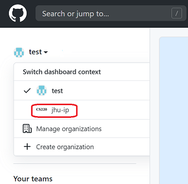

<div class='admonition info'>
<div class='title'>Info</div>
<div class='content'>
<p>This is an in-class exercise. An exercise page like this one will contain a brief description but is intended to be supplemented by discussion during our meeting time. Complete the exercise to the best of your ability in the time given. Feel free to talk with other students as you work, and do not be afraid to ask questions if you get stuck. Aim to complete as much as possible during our meeting, but you need not hand it in. You are encouraged to work at home to complete what you do not get through today.</p>
</div>
</div>

<div class='admonition info'>
<div class='title'>Info</div>
<div class='content'>
<p>If you are new to the course and need a temporary cs account, make a private post on <a href="http://piazza.com/jhu/fall2023/en601220" target="_blank">Piazza</a> to instructors with subject "Request for a cs temp account". You should also do <a href="ex03b.html">Exercise 3-B</a> after you complete Parts 1-4 below.</p>
</div>
</div>

## Learning Objectives
<div class='admonition success'>
<div class='title'>Objectives</div>
<div class='content'>
<p>This exercise will help you gain additional familiarity with:</p>
<ul>
<li>Unix/Linux commands</li>
<li><em>git</em></li>
<li>text editor <em>emacs</em> (or <em>vim</em>)</li>
</ul>
<p>and introduces:</p>
<ul>
<li><em>zip</em> tool for bundling files in Unix/Linux</li>
<li>file transfer tool <em>scp</em> to move files from ugrad to your local machine.</li>
</ul>
</div>
</div>


### Part 1
Log into the ugrad system, stay in your home directory, and configure git within your ugrad account:

**1.**	Type the command: 

```bash
git config --global user.name "Your Name"
```
Be sure to use your actual name inside the quotes.

**2.**	Type the command: 

```bash 
git config --global user.email you@somewhere.com
```
Be sure to use your actual email address. 

**3.** Type the command:
```bash
git config --global credential.helper store
```

This will make it so that you don't have to keep retyping your password every time you do a git command.

<div class='admonition info'>
<div class='title'>Info</div>
<div class='content'>
<p>Note: If you have a Mac you might want to do this in your Terminal later if you want to keep a local copy of your git repo there too.</p>
</div>
</div>

### Part 2
Set up your own personal git repository:

**1.**	You should have received (and accepted) an invitation email to join course Github organization. When you login to your Github, you should be able to see personal repo with the name `2023-fall-student-JHED` where "JHED" is your actual JHED name. This will serve as your private space from here on
that you will use for your exercises and homeworks. Only you and the course staff have access to your private repo.

You probably need to change to the course organization (i.e. jhu-ip) on the left menu as follows:



where instead of _test_, you should see your own Github user name.

**2.**	Now, clone your new (empty) repository into your home directory on ugrad using the https: version of the command given when you click the `Code` button (a green button) in the menu on the right, and then select `Use HTTPS`. Copy the repository url into clipboard and type command:

```bash
git clone URL
```

where URL is replaced by the repo url you copied into the clipboard.

<div class='admonition caution'>
<div class='title'>Tip</div>
<div class='content'>
<p>Unless you have <a href="../resources/github-ssh.html">configured an SSH key for your Github account</a>,
you should use the <code>https</code> Github URL, not the <code>ssh</code> Github URL.</p>
</div>
</div>

<div class='admonition caution'>
<div class='title'>Caution</div>
<div class='content'>
<p>If you get an "authentication failed" error, it means you need to generate a personal access token on Github and use that instead of your password. Follow the steps <a href="https://docs.github.com/en/github/authenticating-to-github/keeping-your-account-and-data-secure/creating-a-personal-access-token">here</a> to make it happen!</p>
</div>
</div>

### Part 3
Create a file on ugrad and add it to the repository:

**1.**	Use `cd` to move into your _2023-fall-student-JHED_ folder (your cloned copy of your repository).  Use `pwd` to check that you are in the right place.

**2.**	Use a text editor (_emacs_ or _vim_) to create a new text file called `README` there. Put _your name, JHED, class year, and major(s)/minor(s)_ in your _README_.

**3.**	Type the command `git status` to see what it reports.

**4.**	Add your _README_ file to your repository using the command `git add README`.

**5.**	Type the command `git status` to see what it reports.

**6.**	Commit your README file to your repository using `git commit -m "created README"`.

**7.**	Type the command `git status` to see what it reports.

**8.**	Send these local changes up to the github repo using `git push`.

**9.**	Type the command `git status` to see what it reports.

**10.**	Type the command `git log` to see what it reports.

**11.**	Edit your _README_ file, and within the file, add a line saying that this is your personal repository for Intermediate Programming at JHU for Spring 2023, and your section number.

**12.**	Check the status again with `git status`, then commit your updated _README_ using `git commit -am "updated README"`. 

<div class='admonition info'>
<div class='title'>Info</div>
<div class='content'>
<p>The <code>-a</code> flag commits all changes to previously added files.</p>
</div>
</div>

Now, push your changes using `git push`. Finally, check your git log again to see how it has changed.  (That is, type the command `git log` to see what it reports.)

**13.**	In your web browser, investigate what has changed in the remote repo on github.com.

### Part 4
Prepare your files as if you were asked to submit them to Gradescope for a homework assignment (but you don’t need to submit them today) - consider this a trial run for turning in an assignment later on. Suppose that an assignment asks you to turn in your new _README_ file, along with a copy of your git log, to show how you have been using git during the assignment.

**1.**	Save a copy of your git log to a text file by typing the command `git log > gitlog.txt`.

**2.**	Use `zip` as indicated below to bundle/compress your repository into a _.zip_ file named _ex03.zip_. The command should look something like: `zip ex03.zip  README  gitlog.txt`. Note that the first argument after `zip` is the name of the _.zip_ file to create; the remaining arguments are the files or folders to bundle together.

**3.**	Use `cd ~` or just `cd` to move into your home directory.

**4.**	Now move (the command `mv` means move, rather than copy) your _.zip_ file to your current location using the following command: `mv 2023-fall-student-JHED/ex03.zip .`. Note that the `.` in the command above indicates that the desired destination is your current working directory.

**5.**	Check to make sure your _.zip_ file contains the right files with `unzip -l` (this says to list the files that would come out if you were to unzip the bundle) as indicated below: `unzip -l ex03.zip`. This will cause a list of the files and directories in your zip file to be displayed on the screen.  It is your chance to double-check that you have included everything.  If you wanted to actually unzip your bundled files (though you do not need to do so now), you could use the unzip command as above, but without the `-l` flag.  You will often want to unzip your file in a folder which is different than the one where you created it, to avoid overwriting your original _README_ and _gitlog.txt_ files.

**6.**	Now that all required files are bundled together as one _.zip_ file, you will need to copy the bundle from ugrad to your local machine. Our tools for accomplishing this will be `scp` (Mac or Linux or Windows Powershell), or either `pscp` or `WinSCP` if installed on Windows.

<div class='admonition info'>
<div class='title'>Mac or Linux Users</div>
<div class='content'>
<p>In a terminal on your local computer, copy your <em>.zip</em> file from ugrad to your local computer using <code>scp &lt;source&gt; &lt;destination&gt;</code>. For example, if you are a user named <em>ips21004</em> connected to ugradx using a Mac, open a new Terminal window on your Mac (not the one in which you are connected to ugradx!), navigate to the folder into which you want the file to be copied and type: <code>scp css22004@ugradx.cs.jhu.edu:ex03.zip .</code>. The source argument above first indicates in what account and on what machine you want to look, then, after the colon, it indicates a relative path from your home directory. The destination argument, however, is simply a dot, because you are typing this command on your Mac and want the file to be transferred to the folder on your Mac that you are currently working in. So, there is no need to specify the destination machine; it is the local one by default.</p>
</div>
</div>

<div class='admonition caution'>
<div class='title'>Tip</div>
<div class='content'>
<p>Do not try to type a <em>./</em> after the colon to start the relative path name, or a <em>~/</em> to indicate an absolute path name; <code>scp</code> will not understand that notation.</p>
</div>
</div>

<div class='admonition info'>
<div class='title'>Windows Users</div>
<div class='content'>
<p>You will need <code>pscp</code> here which should have been installed already automatically when you installed Putty. Copy your <em>.zip</em> file from ugrad to your local computer using <code>pscp &lt;source&gt; &lt;destination&gt;</code>. For example, you could open a Command Prompt window or Powershell and type <code>pscp css22006@ugradx.cs.jhu.edu:2023-spring-student-JHED/ex03.zip .</code>. For Windows where WinSCP has been installed: connect to ugradx using the WinSCP interface and drag the <em>ex03.zip</em> file from the ugradx side to your local computer's side.</p>
</div>
</div>

**7.**	If you wanted to submit this on Gradescope (which we are not actually doing today), you now have a copy of your _.zip_ file on your local computer, and could launch a web browser that will allow you to select the file you wish to upload to Gradescope.

### Part 5 (if time permits)
Work through at least one _emacs_ (or _vim_) tutorial on the course [Resources page](../resources.html). NOTE: whether or not you get to work on it during today's exercise, you are expected to complete a tutorial for one of the two editors before you come to our next meeting. In fact, we recommend completing several; the more times you practice the commands, the quicker you will learn them.

