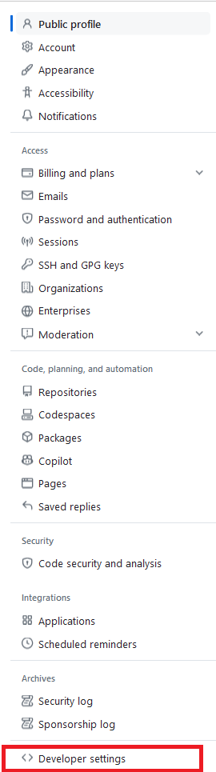

<div class='admonition info'>
  <div class="title">Info</div>
  <div class="content">
	Follow <strong>one</strong> of the sets of instructions below.  You do not need to do both.
  </div>
</div>

<p>Public GitHub repositories (such as the <code>cs220-f24-public</code> repository that we have starter code in) can be cloned without providing any authentication (because they are, after all, <em>public</em>, GitHub doesn't need to know who you are -- anyone can clone them without authenticating themself).  For private repositories, such as those that you'll use for homeworks and projects in this class, you <strong>are</strong> required to authenticate yourself, so that GitHub can verify that you are supposed to have access to this repository.  This page discusses two ways that you can do so.</p>

<ol>
	<li>HTTPS + Token Authentication</li>
	<li>SSH Authentication</li>
</ol>
  
<p>We recommend that you read and follow these instructions carefully. If you follow them exactly, they should work.</p>


## Option 1: HTTPS + Token Authentication

When you clone a (private) GitHub repository, you'll be asked for your GitHub username and password.  The obvious thing to do is enter the same username and password that you use to log into GitHub via a web browser (Firefox, Chrome, etc).  However, this does not work.  For example:

```bash
git clone https://github.com/jhu-ip/ExampleRepo
Cloning into 'ExampleRepo'...
Username for 'https://github.com': kpresler
Password for 'https://kpresler@github.com':
remote: Support for password authentication was removed on August 13, 2021.
remote: Please see https://docs.github.com/get-started/getting-started-with-git/about-remote-repositories#cloning-with-https-urls for information on currently recommended modes of authentication.
fatal: Authentication failed for 'https://github.com/jhu-ip/ExampleRepo/'
```

As the error message tells us, GitHub removed support for password authentication in Summer 2021.  From a security perspective, this is a Good Idea -- using access tokens, which we'll setup shortly, make it easier to contain security breaches, and reduce the potential harm from said breach.  It does, however, make our life slightly more difficult.

To setup a SSH key, log into your GitHub account via a web browser of your choice.  Then, click your account icon in the top-right corner, and then click Settings:


Then, click on Developer Settings from the menu on the left side of the screen:



From here, click `Personal Access Tokens`, then `Tokens (classic)`


Now, click on `Generate New Token`, then `Generate New Token (classic)`:


From here, we'll give the new token we're creating a name, select an expiration date, and configure what permissions you want to grant this token.  This gets back to the idea of security from above -- if someone malicious steals your access token, they won't have full access to your account, only reduced access.  Obviously, we still want to keep our tokens secure.  A reasonable name for your token might be **CS 220**.  Either select **No Expiration Date**, or **Custom** and then enter an expiration date after the end of the semester (if you select **No Expiration Date**, GitHub will warn you that this is not a best practice.  It is not wrong, but no expiration is somewhat more convenient).  Finally, tick the box next to the `repo` permission, which will give this token full access to all repositories your account can create.  We don't need any other permissions, so at this point you can scroll to the bottom and click Generate Token.


You should now get a message saying that your token has been created, as well as telling you what it is.  **Save your token somewhere that you won't lose it** and now, you can use this token whenever Git asks you for a password.  Make sure that you clone all repositories using the HTTPS URL (which is the default one on GitHub):


## Option 2: SSH Authentication

### Creating an ssh public/private keypair

The first step you will need to do is to log into your ugrad account
and run the following command:

```bash
ssh-keygen -t rsa -b 2048
```

When prompted for the file and passphrase, just hit "Enter" to accept the default option.
The output you should see in your terminal should look something like this:

```
[daveho@ugradx ~]$ ssh-keygen -t rsa -b 2048
Generating public/private rsa key pair.
Enter file in which to save the key (/home/daveho/.ssh/id_rsa): 
Created directory '/home/daveho/.ssh'.
Enter passphrase (empty for no passphrase): 
Enter same passphrase again: 
Your identification has been saved in /home/daveho/.ssh/id_rsa
Your public key has been saved in /home/daveho/.ssh/id_rsa.pub
The key fingerprint is:
SHA256:STViaCEiEfnG/GXLBNJtN89FlIo+R6GDEvq0SQs+hx4 daveho@ugradx
The key's randomart image is:
+---[RSA 2048]----+
|++.....oo ooo.   |
|....+.=.oo..o    |
| + o = o.* +     |
|  B + =.+.=      |
| o B X oSo       |
|  E B o o .      |
| . +     o       |
|  .              |
|                 |
+----[SHA256]-----+
```

The `ssh-keygen` command will create a directory in your Linux home directory called
`.ssh`.  Make sure that this directory is only accessible by you by running the
command

```bash
ls -ld ~/.ssh
```

You should see output something like the following:

```
[daveho@ugradx ~]$ ls -ld ~/.ssh
drwx------. 2 daveho users 4 Jan 31 16:55 /home/daveho/.ssh
```

The permissions `rwx------` mean that only your account can read, write, or
execute (search) the contents of the `.ssh` directory, which is what you
want to see.  If you see different permissions, you can fix them by running the command

```bash
chmod 0700 ~/.ssh
```

### Copy your public ssh key to the clipboard

Print the contents of your ssh public key by running the command

```bash
cat ~/.ssh/id_rsa.pub
```

You should see something like the following (it will probably appear as multiple
lines of output in the terminal, but it's really one long line of text):

```
ssh-rsa AAAAB3NzaC1yc2EAAAADAQABAAABAQCqX2atYK7RtuODlxYZ52TpD1abeA7UxUXk4W39ZKKy3n0bguLOzNOveJNiF7ayGtbirGNBVC/f8snNGpFa8EVjW1Wx+yAVBU0sEAz4h1cYarGUNBhr+SgwGbpFHRDjptkkFpfUu6YoAkY6wv4u4s3396EHR0IttUdOqke9OIKt1nQwr1y30qpyXwLj8nd9s4frmFI4Zo/+Gyux1kYX2kg5C8Iao54HDqTRwSbfww/1KANfF3mjfLI9CI/B5y6C4e+JRa4qoN0dAVJxEeyjo3DztdDm18G1vy2Mo4Od7TvjvA2FirDFnonMknd4QoH0tlwtxk4xzFXjZSW2xEEPWxu9 daveho@ugradx
```

Copy the exact text of the public key **that you see in your terminal** to the clipboard.
In Putty, the text you select is automatically copied to the clipboard.  In the MacOS Terminal,
Command-C copies selected text to the clipboard.  In most Linux terminal programs,
Control-Shift-C copies selected text to the clipboard.
Do **not** copy the example key shown above, it will definitely not work.

### Add the public key to your Github account settings

In a web browser, go to [github.com](https://github.com) and log in.  Click the menu icon in the
upper right-hand corner of the window, and choose "Settings".  Click on "SSH and GPG keys".
Click "New SSH key".  You should see something like the following:


Paste the copied ssh public key to the "Key" text box, and enter a name for the
key in the "Title" text box.  This might look something like this:


Now click "Add SSH key" to add the SSH key to your account settings.  You will be
prompted to enter your Github account password to confirm the change.

### Using the SSH repository URL for your private repository

Go to the Github web page for your private repository, and click on "Code". You should
see something like the following:


Click "SSH" so that you see the SSH repository URL. You should see something like this:


Copy the private Github URL to the clipboard.

### Changing your cloned private repository to use SSH authentication

The last thing you will need to do is to change the local clone of your private
repository to use SSH rather than HTTPS to access the remote origin repository.
In your ugrad account, run the following commands:

```
cd ~
cd PRIVATE-REPO-NAME
```

Replace `PRIVATE-REPO-NAME` with the full name of your private Github repository.
This will be something like `2021-spring-student-IDENT` where `IDENT` is your
JHED ID or a similar unique identifier.

Now edit the `.git/config` file within your private repository by running the
following command:

```bash
emacs .git/config
```

You should see something like the following:


Comment out the line beginning `url =` by prefixing it with a `#` character, and add
a new `url =` line with the SSH repository URL.  This should look something like
the following:


Save the file by typing **Control-X** followed by **Control-S**.  The exit
Emacs by typing **Control-X** followed by **Control-C**.

Now, you are ready to test access to your remote repository using ssh.
Run the command

```bash
git pull
```

If the `git pull` command runs without prompting you to enter a password, congratulations,
you are now using SSH to access your remote repository.  All subsequent `git pull` and
`git push` commands will execute without prompting you for a username and password.
